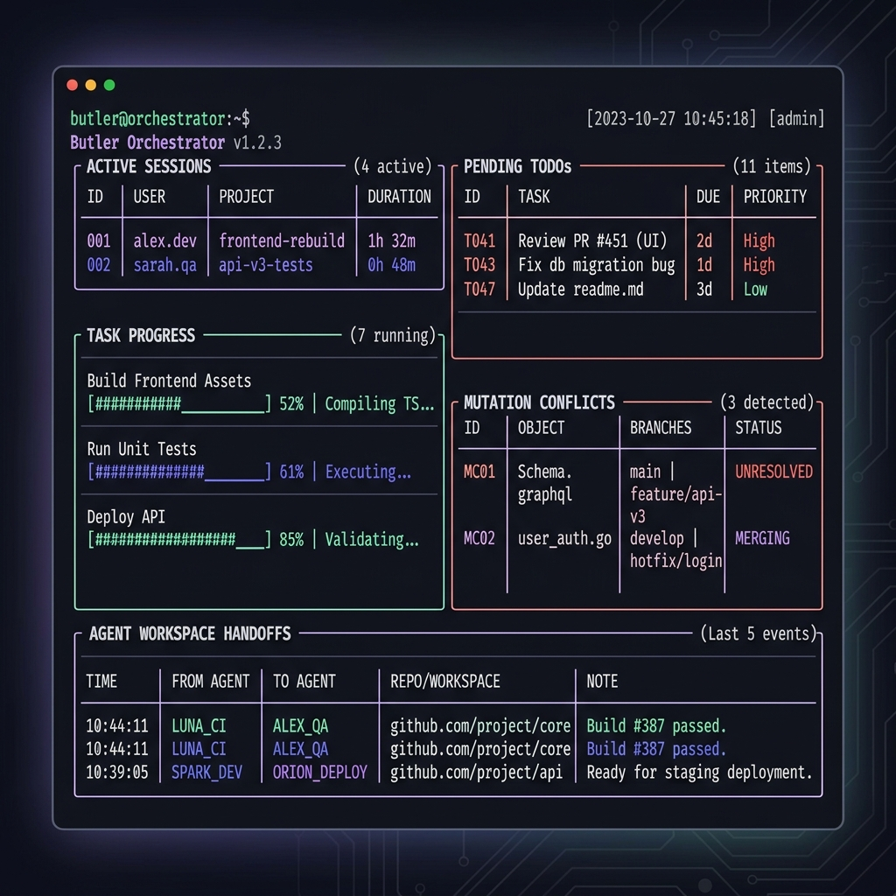
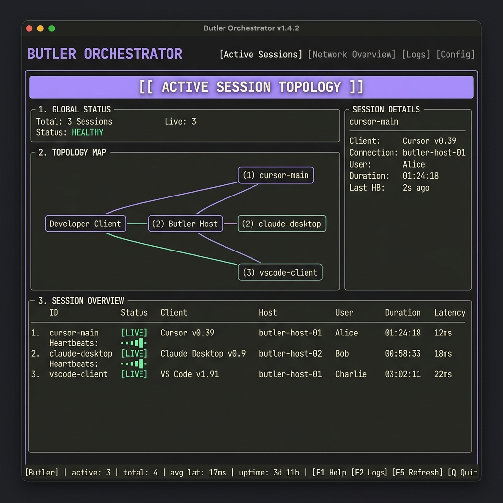
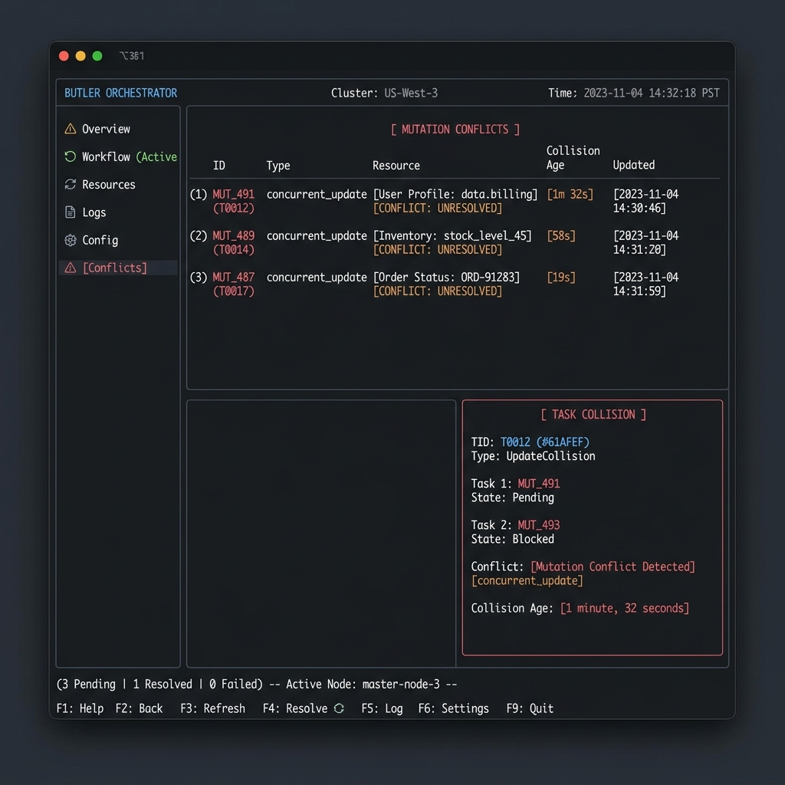
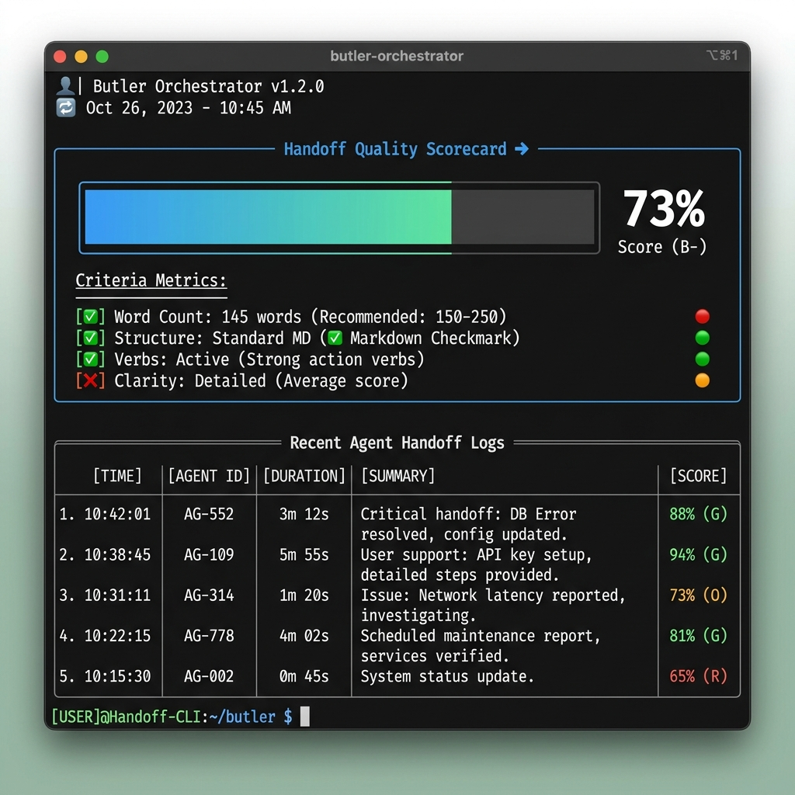
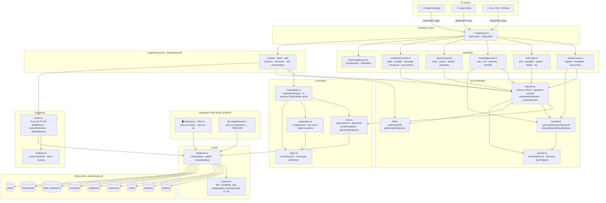

# 🌐 Butler

<!-- mcp-name: io.github.teycir/butler -->


> **Persistent Coordination and Memory Layer for AI Coding Agents.**
>
> *"Simple like Git. Persistent like Notion. Collaborative like Figma. AI-Native like Cursor."*

---

<details>
<summary><strong>🤖 For AI agents: quick server summary (expand)</strong></summary>

```yaml
name: io.github.teycir/butler
package: butler-mcp (npm)
transport: stdio (MCP JSON-RPC)
storage: local SQLite (.butler/butler.db) — no cloud, cross-tool by design
install: npx butler-mcp install
core_loop: projectlist -> sessionregister -> read butler://projects/{id}/context ->
  sessionheartbeat every 15s -> handoffcreate + sessiondisconnect on exit
tools:
  session: [sessionregister, sessionheartbeat, sessiondisconnect]
  tasks: [todoadd, todocomplete, todoupdate, tododelete, todolist]
  coordination: [todoclaim, todounclaim, messagesend, broadcast, synccontext]
  knowledge: [wikiupdate, ruleadd, ruleremove, decisionrecord, handoffcreate]
  memory: [memorystore, memorysearch, memorydelete, projectlist]
  observability: [eventsexport, butlerping]
resources:
  - butler://projects/{id}/context        # markdown packet: TODOs, rules, decisions, wiki, handoffs
  - butler://projects/{id}/todos          # JSON
  - butler://projects/{id}/wiki           # JSON
  - butler://projects/{id}/sessions       # JSON
  - butler://projects/{id}/memories       # JSON
  - butler://projects/{id}/diff?since={eventId}  # JSON changelog
  - butler://projects/{id}/orchestration  # LangGraph checkpoints, JSON
manifests:
  - server.json                          # Official MCP Registry manifest
  - .well-known/mcp/server-card.json     # SEP-1649 server card
  - .well-known/mcp.json                 # SEP-1960 discovery pointer
  - llms.txt                             # plain-text agent summary
```

Full schemas: `src/mcp/tools/*.tools.ts`, or query `tools/list` over MCP. See [Discovery & Registries](#-discovery--registries) for where this server is indexed.

</details>

---

[](#)
[](#)
[](#)
[](#)
[](#)
[](#)

---

## 🎯 Use Cases

Butler's core value isn't just that an agent *remembers* — it's that the memory is **portable across completely different AI tools**, because it lives in a shared local SQLite file rather than inside any one vendor's session. That's what makes cross-tool continuity possible in the first place.

| Scenario | What happens without Butler | What Butler does |
| :--- | :--- | :--- |
| **Claude Code runs out of credits mid-task** | You switch to Kiro CLI (or Cursor, or anything else) and it starts from zero — no idea what Claude Code already did | Kiro CLI registers a session, reads `butler://projects/{id}/context`, and picks up exactly where Claude Code left off: the same TODOs, rules, decisions, and the `handoffcreate` summary Claude Code recorded before running out |
| **Planning in one tool, implementing in another** (e.g. plan in Claude Desktop, implement in Cursor) | The implementing tool starts cold — no idea what was decided or done | The new session reads `/context` and instantly gets the prior session's handoff summary, open TODOs, and rules — regardless of which vendor built either tool |
| **Two agents (possibly different tools) editing the same repo concurrently** | Silent overwrites or duplicated work on the same task | `todoclaim`/`todounclaim` mark tasks as in-progress across tools; `todocomplete`/`todoupdate` use optimistic version locks and emit a `TODO_CONFLICT` event if two sessions touch the same TODO within seconds |
| **An agent crashes or the terminal is closed** | Its in-progress claims stay locked forever; no record of what it was doing | The lifecycle monitor marks the session `stale` after 60s, `dead` after 5 minutes, auto-releases its claims, and synthesizes an ungraceful handoff for whichever tool picks it up next |
| **Coordinating a large refactor across sessions/tools** | Agents don't know what their peers (on other tools) are touching | `messagesend` for direct heads-up between two sessions, `broadcast` for announcements to everyone, both surfaced in the next `/context` read regardless of client |
| **Recording *why* a design decision was made** | Rationale lives only in one tool's chat history and gets lost when the window closes or credits run out | `decisionrecord` logs an ADR (context + outcome) directly into the durable, tool-agnostic event log and project wiki |
| **Onboarding a new agent/session into an existing project** | Re-explaining architecture, constraints, and conventions from scratch every time — and again for every different tool you try | `ruleadd` persists coding guidelines every session must follow, on every client; `wikiupdate` builds a shared reference doc; both are pulled into `/context` automatically |
| **Finding relevant past context without re-reading everything** | Manually grepping chat logs or the whole codebase — and chat logs from other tools aren't even accessible | `memorysearch` runs hybrid TF-IDF + recency ranking over stored summaries, decisions, rules, and wiki pages, shared by every connected tool |
| **Auditing what happened in a project over time** | No structured history, just scattered chat transcripts split across whichever tools were used | `eventsexport` dumps the full append-only event log as JSON/NDJSON, filterable by session, type, or time range — one log, all tools |
| **Multi-step agent orchestration** (e.g. Plan → Implement → Verify → Commit, each stage potentially a different tool) | Each phase runs in isolation with no shared checkpoint state | The built-in LangGraph checkpointer (`getLangGraphCheckpointer()`) persists thread state in the same SQLite DB, and `buildOrchestratorGraph` coordinates hand-offs between planning/implementing/verifying agents |
| **Watching a live multi-agent, multi-tool workspace** | No visibility into who's doing what right now, especially across different clients | `butler tui` / `butler dashboard` show live sessions from every connected tool, claims, conflicts, and handoff quality in real time |

---

#### 🌟 Features Showcase

| 🖥️ Live Orchestration Dashboard | 👤 Active Session Topology & Status |
| :---: | :---: |
|  |  |
| **⚡ Concurrency Mutation Conflicts** | **🤝 Handoff Quality Scorecard & Coaching** |
|  |  |

---

## 📑 Table of Contents

- [Use Cases](#-use-cases)
- [Butler in 3 Minutes](#-butler-in-3-minutes)
- [Quickstart](#-quickstart)
- [System Architecture](#️-system-architecture)
- [Workflow Demo](#-workflow-demo-cross-client-session-continuity)
- [Core Terminology](#-core-terminology)
- [API & Tool Surface](#-api--tool-surface)
  - [Resources](#resources)
  - [Session Management](#session-management)
  - [Task Management](#task-management)
  - [Multi-Agent Coordination](#multi-agent-coordination)
  - [Knowledge & Memory](#knowledge--memory)
  - [Observability](#observability)
- [Developer CLI](#️-developer-cli)
- [Butler Workflow Skill](#-butler-workflow-skill)
- [Zero-Intervention Automation](#-zero-intervention-automation)
- [Workflows, Best Practices & Troubleshooting](docs/workflows-best-practices.md)
- [Context Freshness & Staleness](#-context-freshness--staleness)
- [Multi-Agent Conflict Detection](#-multi-agent-conflict-detection)
- [Schema Migration](#️-schema-migration)
- [Multi-Agent Orchestration & LangGraph Integration](#-multi-agent-orchestration--langgraph-integration)
- [Repository Anatomy](#-repository-anatomy)
- [Principles](#-principles)
- [Discovery & Registries](#-discovery--registries)
- [Related Projects](#-related-projects)

---

## ⚡ Butler in 3 Minutes

### What is Butler?
Butler is a lightweight, local-first background coordination engine that registers active AI agents (e.g. Claude Desktop, Cursor, custom IDE tools) and maintains a **shared, event-sourced memory space** directly inside your project repository.

**Butler features native [LangGraph](https://github.com/langchain-ai/langgraphjs) integration, providing a built-in SQLite checkpointer to save/restore multi-agent conversation threads and coordinate workflow graphs directly in the project database.**

### Why does it exist?
Coding agents are fundamentally **amnesiac**. When Cursor reloads or a process exits, active context (TODOs, architectural constraints, session differences) is completely lost. When multiple agents run concurrently, they operate in silos, generating race conditions and divergent branches. Butler bridges this gap.

### Who is it for?
*   **AI Pair Programmers:** Developers working interchangeably across multiple LLM clients (e.g., planning in Claude, implementing in Cursor).
*   **Multi-Agent Workspaces:** Teams running concurrent background AI workers on the same repository.
*   **Local-First Advocates:** Engineers seeking zero network leakages and absolute privacy.

### Why not alternatives?

Unlike general-purpose agent memory platforms (which require hosted cloud APIs, external vector databases, or wrapping your code in framework SDKs), **Butler is a local-first developer utility**. It integrates directly with your existing workspace as a standard Model Context Protocol (MCP) server. Running a single `npx` command auto-configures your entire IDE stack (Cursor, Claude Desktop, VS Code, Zed) to instantly share project-level context, prevent concurrent file-editing conflicts, and persist active tasks directly within your repo's local SQLite database—with zero network leakage, zero dependencies, and zero setup latency.

#### 1. Butler vs. Dedicated Agent Memory Systems

| Dimension | Butler | Mem0 | Letta (MemGPT) | LangMem | Zep |
| :--- | :--- | :--- | :--- | :--- | :--- |
| **Primary Use Case** | **AI coding client memory & repo state coordination** | General-purpose personalization APIs | Long-running autonomous OS-like agents | LangGraph-native agent prompt refinement | Temporal context & enterprise data graphs |
| **Local Footprint** | **0-Click Local SQLite** (stored inside the repository) | Hybrid Cloud API or self-hosted vector database | Local/Cloud server (requires separate Docker/process) | Cloud-first managed service by LangChain | Cloud-first or heavy Docker dependencies |
| **MCP Native** | **Yes** (integrated in Claude Desktop, Cursor, VS Code, Zed) | No | No (uses custom REST/Websocket API) | No | No |
| **IDE/CLI Auto-Install** | **Yes** (`npx butler-mcp install` auto-configures clients) | No | No | No | No |
| **LangGraph Support** | **Yes** (Built-in SQLite checkpointer for LangGraph JS) | No | No | Yes (native SDK integration) | No |
| **Concurrency Control**| **Yes** (Optimistic locking for parallel agents editing code) | No | No | No | No |
| **Amnesia Prevention** | **Yes** (Maintains context state across IDE reloads/restarts) | No (Focuses on user memory, not project state) | Yes (for its own custom agents) | Yes (primarily via API state stores) | Yes (via temporal memory logs) |

#### 2. Butler vs. Ad-hoc Storage & Databases

| Dimension | Butler | Plain Text Files (`context.txt`) | Heavy DBs (Postgres/Redis) |
| :--- | :--- | :--- | :--- |
| **Portability** | 0-Click Local SQLite | Hard to version-control safely | Complex Docker setup |
| **State Conflict** | Optimistic Lock Versions | Prone to complete overrides | Manual locks required |
| **Recovery** | Ephemeral heartbeats & handoffs | None (static data) | Complex event logs |
| **Context Size** | Materialized incremental views | Massive raw token bloat | Ad-hoc query builds |

---

## ⏱️ Quickstart in 30 Seconds (via npx)

The fastest way to install and configure Butler is via `npx`:

```bash
npx butler-mcp install   # Scans and auto-configures all active clients (Claude, Cursor, VS Code, Zed, Windsurf, etc.)
npx butler-mcp status    # Runs the visual status CLI
npx butler-mcp dashboard # Runs the web dashboard
```

---

## ⏱️ Quickstart from Source

### 1. Clone:
```bash
git clone https://github.com/Teycir/Butler.git
cd Butler
```

### 2. Install — choose your method:

#### Option A: Automatic installer (recommended)

**Linux / macOS:**
```bash
bash install/install.sh
```

**Windows (PowerShell):**
```powershell
.\install\install.ps1
```

The installer will:
- Build Butler from source.
- Deploy the production bundle to `~/Mcp/butler-mcp/`.
- Automatically scan the host machine for active coding clients.
- Inject the Butler MCP configuration into all detected clients (supporting **Claude Desktop**, **Claude Code**, **Cursor**, **VS Code**, **Windsurf**, **Zed**, **Gemini CLI**, **Kiro CLI**, and **Kilo Code**).
- **JSONC / Comment Safe**: Safely parses configurations with comments and trailing commas without overwriting custom settings.

> **Custom DB path:** Pass `--db-path` to use a custom SQLite file location:
> `bash install/install.sh --db-path /your/path/butler.db`
> Or on Windows:
> `.\install\install.ps1 -DbPath "C:\your\path\butler.db"`

#### Option B: Manual setup

```bash
npm install
npm run build
```

Then add Butler to your AI client's MCP config manually:

```json
{
  "mcpServers": {
    "butler": {
      "command": "node",
      "args": ["/absolute/path/to/Butler/dist/index.js"],
      "env": {
        "BUTLER_DB_PATH": "/absolute/path/to/butler.db"
      }
    }
  }
}
```

Config file locations:
- **Claude Desktop (Linux):** `~/.config/Claude/claude_desktop_config.json`
- **Claude Desktop (macOS):** `~/Library/Application Support/Claude/claude_desktop_config.json`
- **Claude Desktop (Windows):** `%APPDATA%\Claude\claude_desktop_config.json`
- **VS Code / Cursor:** `mcp.json` in your user settings directory
- **Kiro CLI:** `~/.config/kiro-cli/mcp.json`
- **Kilo Code:** `~/.config/Antigravity/User/globalStorage/kilocode.kilo-code/settings/mcp_settings.json`

**Example: Kiro CLI configuration (`~/.config/kiro-cli/mcp.json`)**

```json
{
  "mcpServers": {
    "butler": {
      "command": "/home/user/.nvm/versions/node/v20.20.0/bin/node",
      "args": [
        "/home/user/Mcp/butler-mcp/dist/index.js"
      ],
      "env": {
        "BUTLER_DB_PATH": "/home/user/.butler/butler.db"
      }
    }
  }
}
```

Restart your AI clients and Butler is ready.

---

## 🌟 The Core Vision

Coding agents today are incredibly powerful but fundamentally **amnesiac**. When your Cursor window reloads or Claude Desktop restarts, your active context, developer constraints, completed tasks, and architectural decisions are erased. 

Even worse, when **multiple agents work on the same codebase simultaneously**, they operate in completely disjoint silos, causing race conditions, diverging implementations, and broken handoffs.

Butler bridges this gap by acting as a local, background **Durable Project Memory Log**:

```text
               🤖 Agent A (Claude)        🤖 Agent B (Cursor)
                       \                      /
                        \                    /
                 [ Model Context Protocol stdio transport ]
                                    ↓
                       ===========================
                       │         BUTLER          │
                       │  Durable Shared Memory  │
                       ===========================
                       /      │           │      \
                     /        │           │        \
                    ▼         ▼           ▼         ▼
                🎯 TODOs   📜 Rules   💡 Decisions  📚 Wiki
```

---

## 🧠 Core Terminology

To understand Butler in under two minutes, here are our core conceptual models:

*   **Project:** The permanent codebase workspace. Lives forever, anchored by a local-first SQLite file (`.butler/butler.db`).
*   **Session:** An ephemeral window of activity by a specific AI client (e.g. `cursor-1`, `claude-desktop-2`). Sessions send periodic heartbeats to prove presence.
*   **Event:** An append-only, immutable transaction log entry representing a discrete state change (e.g. `TODO_CREATED`, `RULE_ADDED`, `WIKI_UPDATED`). **Events are the ground truth.**
*   **State:** A materialized cache of the project's current status (active tasks, wiki pages, rules) constructed incrementally by playing events. **State is the cache.**
*   **Handoff:** A structured, context-rich handoff payload generated when a session disconnects, capturing exact achievements and pending blockers.
*   **Memory:** Highly searchable semantic guidelines, observations, and design logs indexed locally using light, zero-click Term Frequency-Inverse Document Frequency (TF-IDF) sparse relevance algorithms.

---

## 🏗️ System Architecture

Butler is designed to be operationally invisible and incredibly fast. It operates on an **event-sourced, materialized-view model** backed by SQLite in Write-Ahead Log (WAL) mode.



---

## 🔄 Workflow Demo: cross-client session continuity

Imagine this workflow:

1.  **Start in Cursor:** You ask Cursor to plan a database migration. Cursor registers a session, creates 3 TODOs, and records a design decision (`ADR-001`).
2.  **Cursor Window Reloads / Crashes:** The Cursor session terminates. Butler detects the disconnection, automatically materializes a structured handoff marker, and updates the event log.
3.  **Resume in Claude Desktop:** You open Claude Desktop. Claude registers its session.
4.  **Instant Rehydration:** Claude reads the `butler://projects/{id}/context` resource. It instantly receives:
    *   The structured handoff summarizing Cursor's accomplishments.
    *   The exact pending TODO list.
    *   The active project rules and architectural constraints.
    Claude immediately resumes work with **zero lost context**.

---

## ⚡ Quickstart

### 1. Installation
```bash
git clone https://github.com/Teycir/Butler.git
cd Butler
```

**Linux / macOS:**
```bash
bash install/install.sh
```

**Windows (PowerShell):**
```powershell
.\install\install.ps1
```

The installer builds Butler, deploys the release to `~/Mcp/butler-mcp/`, and auto-configures detected clients (including Claude Desktop, Claude Code, Cursor, VS Code, Windsurf, Zed, Gemini CLI, Kiro CLI, and Kilo Code) safely. Restart your AI clients and Butler is ready.

> **Custom DB path:** Pass `--db-path` to specify a custom database location:
> `bash install/install.sh --db-path /your/path/butler.db`
> Or on Windows:
> `.\install\install.ps1 -DbPath "C:\your\path\butler.db"`

#### Verify Installation

Open your AI client (Claude Desktop, Cursor, etc.) and ask:

> "Can you call the `butlerping` tool?"

Expected response:
```json
{
  "status": "ok",
  "db_path": "/home/user/.butler/butler.db",
  "db_size_kb": 142,
  "schema_version": 8,
  "project_count": 3,
  "uptime_seconds": 3621
}
```

### 2. Zero-Config Project Default

Drop a `.butler/project.json` in your repo root to set a default project for all tool calls:

```json
{ "project_id": "my-project" }
```

Butler walks up the directory tree to find this file automatically. Once set, every tool call in that workspace resolves `project_id` without you passing it explicitly.

### 3. Run the Verification Suite
```bash
npm test
```

---

## 🔌 API & Tool Surface

### Resources

| URI | Description |
| :--- | :--- |
| `butler://projects/{id}/context` | Unified markdown context packet: TODOs, rules, decisions, wiki, sessions, handoffs, messages, broadcasts, and auto-surfaced relevant memories. Includes a `🟢/🔴` freshness badge and staleness metadata. |
| `butler://projects/{id}/todos` | Materialized active task list (JSON). |
| `butler://projects/{id}/wiki` | Shared wiki and reference documents (JSON). |
| `butler://projects/{id}/sessions` | Active and stale session registry (JSON). |
| `butler://projects/{id}/memories` | Complete project memory log (JSON). |
| `butler://projects/{id}/diff?since={eventId}` | Compact changelog of all state changes since a given event ID, grouped by type. |
| `butler://projects/{id}/orchestration` | LangGraph orchestration checkpoints and execution state stored for the project (JSON). |

### Tools

#### Session Management
| Tool | Description |
| :--- | :--- |
| `sessionregister` | Bind an active client session. Idempotent — reconnecting agents reuse their session. |
| `sessionheartbeat` | Signal presence every 15 seconds to stay alive in shared context. |
| `sessiondisconnect` | Gracefully disconnect and broadcast a structured continuity handoff. |

#### Task Management
| Tool | Description |
| :--- | :--- |
| `todoadd` | Create a task with priority (`low`/`medium`/`high`) and optimistic version locking. |
| `todocomplete` | Mark a task done with conflict detection against concurrent mutations. |
| `todoupdate` | Update a TODO's title, priority, or status with version checking. |
| `tododelete` | Delete a TODO with optimistic version checking. |
| `todolist` | List all TODOs for a project (filterable by `pending`/`completed`/`all`). |

#### Multi-Agent Coordination
| Tool | Description |
| :--- | :--- |
| `todoclaim` | Claim a TODO as actively being worked. Other agents see it as 🔒 in-progress. Claims expire when the session goes stale. |
| `todounclaim` | Release a claim, making the TODO available again. |
| `messagesend` | Send a direct message to another active session (stored in event log; delivered on reconnect). |
| `broadcast` | Announce something to all active sessions — visible in every agent's next context read under 📢 Broadcasts. |
| `synccontext` | Force an immediate context sync across all peer sessions, surfacing the latest shared state without waiting for the next heartbeat cycle. |

#### Knowledge & Memory
| Tool | Description |
| :--- | :--- |
| `wikiupdate` | Create or update a wiki knowledge base page. |
| `ruleadd` | Add a persistent coding guideline all agents must follow. |
| `ruleremove` | Remove a persistent guideline by ID. |
| `decisionrecord` | Log an architectural decision record (ADR) with context and outcome. |
| `handoffcreate` | Explicitly broadcast a session handoff. Includes quality scoring (0–100%) with inline coaching feedback. |
| `memorystore` | Store a semantic project memory (type: `summary`, `decision`, `rule`, `wiki`). |
| `memorysearch` | Search project memory using hybrid TF-IDF keyword + recency ranking. |
| `memorydelete` | Delete a memory by ID to remove stale or incorrect information. |
| `projectlist` | List all projects in the Butler database. |

#### Observability
| Tool | Description |
| :--- | :--- |
| `eventsexport` | Export the raw event log as `json` (array) or `ndjson` (newline-delimited). Supports `since`, `until`, `session_id`, `event_type`, and `limit` filters. Default 500, max 5000 events. |
| `butlerping` | Lightweight health-check returning DB path, size, schema version, project count, and uptime. |

---

## 🖥️ Developer CLI

Butler ships with a local command line interface (CLI) to configure, manage, and monitor your multi-agent workspaces — no MCP server connection required to run diagnostics or status checks.

### `butler clients`

Manages the opt-in registry of AI client config files Butler installs into (persisted to `~/.butler/clients.json`).

```text
$ butler clients list

📋 Known AI clients

  ✅  claude-desktop
           /home/user/.config/Claude/claude_desktop_config.json
     cursor
     vscode
     windsurf
     zed
     kiro-cli
     kilo-code
     ...

  1 client(s) registered. Run `butler install` to apply.
```

- `butler clients list` — show all known client slugs plus which ones are currently registered.
- `butler clients add <slug>` — register a known slug (resolves its default path automatically), or pass `--path /path/to/config.json` to register a custom/unknown tool under that slug.
- `butler clients remove <slug>` — unregister a slug.

**Note:** once at least one client has been registered (manually or via auto-detect on the very first `butler install` run), `butler install` only injects into the registered set — it does **not** re-scan for newly installed IDEs on subsequent runs. Use `butler clients add <slug>` to pick up a new client later.

### `butler install`

Deploys the Butler production bundle to `~/Mcp/butler-mcp` and injects the Butler MCP server configuration into your registered AI client configuration files. If no clients are registered yet (i.e. this is the first run), it scans your system once to auto-detect and register active clients; on subsequent runs it only touches whatever is already registered in `~/.butler/clients.json` (see `butler clients` above). It supports comments (JSONC) and trailing commas safely.

```text
$ butler install
🔨 Building from source...
🚀 Syncing to /home/user/Mcp/butler-mcp...

🔧 Injecting Butler into registered AI clients...
  ✅ /home/user/.config/Claude/claude_desktop_config.json
  ✅ /home/user/.config/Cursor/User/mcp.json
  ✅ /home/user/.config/zed/settings.json
  ...

🎉 Done! Restart your AI clients to activate Butler.

──────────────────────────────────────────────────────────────────
📋  SYSTEM PROMPT SNIPPET — paste this into your AI client once:
──────────────────────────────────────────────────────────────────

On startup: call projectlist, then sessionregister (project_id from .butler/project.json or ask the user, session_id = "<client>-<4 random chars>", client_type = your tool name). Heartbeat every 15 seconds. Before exit: call handoffcreate with a summary of what you did, then sessiondisconnect.

🧪 Verifying setup...
Open any registered client and ask: 'Can you call the butlerping tool?'
Expected response: status: ok, schema_version: 8
```

### `butler init`

Interactively initializes a new project configuration inside your local workspace. This creates `.butler/project.json` and adds it to your `.gitignore` so your agents can automatically identify the correct project database namespace.

```text
$ butler init
🌐 Butler — Project Setup

? Project ID [default: my-project]: my-project
? Project name (optional): My Project Workspace
? Default client [default: Claude Desktop]: Claude Desktop

✅ Created .butler/project.json
✅ Added .butler/ to .gitignore
✅ Ready! Open your AI client and start coding.
```

### `butler status`

Reads the global SQLite database (`~/.butler/butler.db`) directly and outputs a comprehensive diagnostic summary of the workspace's projects, sessions, active/completed tasks, and recent handoffs.

```text
$ butler status
🤵  Butler Status   15/06/2026 20:08:12
    Database: /home/user/.butler/butler.db
    Projects: 4

╔═══════════════════════════════════╗
║  🌐 Butler — Butler               ║
║  🔴 INACTIVE  |  0 live sessions  ║
╚═══════════════════════════════════╝

SESSIONS
  No active sessions
  ⚫  1 dead session(s) hidden

TODOS (0 open, 0 completed)
  No open TODOs

🤝  RECENT HANDOFFS (last 3)
  [system]  claude-r4x  (127h ago)
          "Session claude-r4x lost connection (missed heartbeat). Auto-generated c…"
  [system]  claude-r4x  (127h ago)
          "Session claude-r4x lost connection (missed heartbeat). Auto-generated c…"

HANDOFF QUALITY SCORE  █████░░░░░  49% (last: claude-r4x)

Event log: 19 events | last: 127h ago
Snapshot:  no snapshot yet
```

Supports `--project <id>`, `--db <path>`, `--json`, and `--help` flags.

### `butler tui`

Launches a live split-screen Terminal User Interface (TUI) that refreshes every 2 seconds, displaying real-time agent presence, broadcast events, active tasks, version conflicts, and handoff quality metrics.

```text
┌──────────────────────────────────────────────────────────────────────────────────────────────────┐
│ 🤵 BUTLER ORCHESTRATOR │ Project: api-hunter                                     ● 20:13:57 │
│ DB: ~/.butler/butler.db (128 KB)                │ Schema: v8 │ Projects: 4 │ Status: 🟢 HEALTHY  │
├────────────────────────────────────────────────┬─────────────────────────────────────────────────┤
│ 👤 Topology Sessions (2)                       │ 🎯 Shared Task Space (3 open)                    │
│   ● cursor-main-1    cursor       12s ago      │   Progress: [██████░░░░░░░░░░] 37% (6/16 done)   │
│   ○ claude-desk-2    claude       45s ago      │   ■ HGH [#1] Implement JWT signat… │ 🔒 cursor-m… │
│                                                │   ■ MED [#2] Add OAuth tests       │ unclaimed    │
│ 📢 Broadcast Stream (2)                        │   ■ LOW [#3] Verify README typos   │ unclaimed    │
│   10s ago [cursor-m]: refactored auth.ts       │                                                  │
│   45s ago [claude-d]: pulling main branch      │ ⚡ Mutation Conflicts (1)                         │
│                                                │   ⚠️  Task #1 │ concurrent_update │ 8s ago    │
├──────────────────────────────────────────────────────────────────────────────────────────────────┤
│ 🤝 RECENT WORKSPACE HANDOFFS                                                                      │
│   [agent] cursor-main-1 (10m ago) - "Refactored JWT signature checking and fixed algorithm bypass."│
│   [system] claude-desk-2 (25m ago) - "Session claude-desk-2 disconnected gracefully."            │
│   Quality Rating: [███████████░░░░] 73% (latest: cursor-main-1) │ Words: 24 │ Struct: ✓ │ Verbs: ✓│
├──────────────────────────────────────────────────────────────────────────────────────────────────┤
│ Events: 142 │ Last Event: TODO_COMPLETED (12s ago)        [Q] Quit │ [R] Refresh │ Auto-Refresh: 2s  │
└──────────────────────────────────────────────────────────────────────────────────────────────────┘
```

*Interactive controls:* Press `q` to quit, `r` to force a manual refresh.

### `butler dashboard`

Starts a local web dashboard with SSE (Server-Sent Events) live pushing every 5 seconds to show active sessions, TODOs, conflict lists, and event trails. Runs **read-only** by default.

```text
$ butler dashboard
🌐 Serving Butler dashboard at http://localhost:7888
```

Pass `--dev` to start it in **writable** mode instead, which lets you complete, edit, or delete TODOs and send broadcasts directly from the dashboard UI (in addition to the read-only view):

```bash
npx tsx src/cli/dashboard.ts --dev
# Mode:     dev-writable
```

Supports `--port <n>`, `--host <addr>`, `--db <path>`, and `--dev` flags.

### `butler ping`

Outputs structured database size and schema metrics as JSON. Perfect for piping to `jq` or integrating into external status monitoring tools.

```json
{
  "status": "ok",
  "db_path": "/home/user/.butler/butler.db",
  "db_size_kb": 128,
  "schema_version": 8,
  "project_count": 4
}
```

### `butler doctor`

Runs environmental diagnostics to ensure Node.js compatibility, built output validity, database state, and client MCP configurations are set up correctly.

```text
$ butler doctor
🩺 Butler Doctor Diagnostics

✅ Node.js v20.20.0 — OK
✅ Butler build — OK (dist/index.js exists)
✅ Database — OK (/home/user/.butler/butler.db, schema v8)
✅ Claude Desktop config — OK (butler entry found)
⚠️  Cursor config — NOT FOUND (missing file)
✅ Kiro CLI config — OK (butler entry found)
✅ VS Code config — OK (butler entry found)
✅ Kilo Code config — OK (butler entry found)

Fix: Run `butler install` to repair configuration files.
```

---

## 🧩 Butler Workflow Skill

Butler includes a portable skill package that teaches AI agents how to use Butler's coordination features effectively. The skill is available in `skills/butler-workflow/`.

### Installation

**For Kiro CLI / Kilo Code / Claude Code:**
```bash
cp -r skills/butler-workflow ~/.kiro/skills/
# or
cp -r skills/butler-workflow ~/.agents/skills/
```

**For other agents:**
Copy the skill to your agent's skill directory and it will be auto-loaded on startup.

### What the Skill Teaches

The `butler-workflow` skill provides comprehensive patterns for:

- **Session Lifecycle:** Register → heartbeat → handoff → disconnect
- **TODO Workflow:** Create → claim → work → complete with conflict prevention
- **Memory Management:** Store decisions, search context, clean up stale data
- **Multi-Agent Coordination:** Messages, broadcasts, conflict detection
- **Best Practices:** When to register, how to handoff, what to persist

### Usage

Once installed, agents automatically learn Butler patterns. The skill teaches agents to:

1. Register sessions at startup with unique session IDs
2. Send heartbeats every 15-30 seconds during active work
3. Claim TODOs before starting to prevent conflicts
4. Store important decisions with appropriate importance scores
5. Create quality handoffs when switching contexts
6. Coordinate with other active sessions via messages

See `skills/butler-workflow/SKILL.md` for full documentation and examples.

---

## 🤖 Zero-Intervention Automation

Butler is designed to run completely in the background. **All you need to do is install the MCP server and copy the skill package to your agent folder. Butler handles the rest automatically.**

When you open any directory to work:
1. **Butler automatically configures the project** by creating `.butler/project.json` (derived from the directory name).
2. **The agent automatically joins** and heartbeats in the background.
3. **The agent automatically records context** and leaves a handoff on exit.

You do not need to run any initialization commands or setup scripts. It just works.

### 1. Zero-Config Auto-Creation (`.butler/project.json`)
To make onboarding effortless, Butler automatically handles project configuration:
- **Automatic Setup**: If a connecting agent runs inside a workspace that does not contain a `.butler/project.json` file, Butler will automatically:
  1. Create the `.butler/` directory.
  2. Normalize the current working directory's folder name to generate a clean, kebab-case `project_id` (e.g. `some-cool-project`).
  3. Write a default `project.json` containing that ID.
- **Manual Override**: You can change or override the default ID at any time by editing the `"project_id"` field in `.butler/project.json`.
- **Result**: Zero configuration or manual creation steps are required when opening new directories.

### 2. Auto-Run via Agent Skills
Deploy the `butler-workflow` skill package to your agent's skill directory:
```bash
# For Agy / Claude Code / Antigravity
cp -r skills/butler-workflow ~/.agents/skills/

# For OpenCode
cp -r skills/butler-workflow ~/.config/opencode/skill/

# For Kiro CLI / Kilo Code
cp -r skills/butler-workflow ~/.kiro/skills/
```
- **Result**: Connecting agents load this skill on startup and execute the session lifecycle autonomously:
  - Registers the session on startup.
  - Starts a silent background timer emitting heartbeats every 15s.
  - Automatically fetches context and reads tasks.
  - Generates a structured handoff and disconnects gracefully on exit.

### 3. Client System Instructions
If using standard LLM clients (Claude Desktop, Cursor, VS Code, ChatGPT) without a skill loader, append this directive to your agent's global System Prompt instructions:
> On startup, call `projectlist` or check `.butler/project.json` to find the active project. Call `sessionregister` (generate a unique `session_id`). Fetch `butler://projects/{id}/context` to catch up. Send heartbeats every 15 seconds. Before exit, run `handoffcreate` and call `sessiondisconnect`.

### 4. Self-Healing Presence Sweeps
If an agent crashes or the terminal is closed abruptly, Butler automatically self-heals:
- The background lifecycle monitor sweeps active heartbeats every 15 seconds.
- If a session misses heartbeats for 60 seconds, it is marked `stale`.
- After 5 minutes, it is marked `dead`, its task claims/locks are automatically released for other sessions, and an ungraceful continuity handoff is synthesized to record what was left behind.

---

## 🔍 Context Freshness & Staleness

Every `/context` read opens with a freshness badge:

- `🟢` — at least one session is alive and actively heartbeating
- `🔴` — no live sessions; context was last updated some time ago

The raw JSON payload (second content block on `/context`) also includes a `staleness` object:

```json
{
  "last_live_heartbeat": 1716900000,
  "has_live_session": false,
  "events_since_last_read": 12,
  "context_age_seconds": 720
}
```

Agents reconnecting after a gap can use `last_event_id` + the `/diff` resource to fetch only what changed, rather than re-reading the full context.

---

## 🤝 Multi-Agent Conflict Detection

When two sessions complete or update the same TODO within a 10-second window, Butler appends a `TODO_CONFLICT` event alongside the mutation. These conflicts surface in the `/context` resource under **⚡ Recent Coordination Conflicts**, letting all agents see where parallel writes collided and coordinate resolution.

---

## 🗄️ Schema Migration

Butler uses a versioned migration runner backed by a `butler_migrations` tracking table. Each migration:
- Runs inside a transaction — failure rolls back cleanly
- Is idempotent — applied exactly once, never re-run
- Records version number, description, and `applied_at` timestamp

The `VERSIONED_MIGRATIONS` array in `schema.ts` is the single source of truth. Pre-existing databases are automatically brought up to date on startup.

---

## 🤖 Multi-Agent Orchestration & LangGraph Integration

Butler features first-class integration with [LangGraph](https://github.com/langchain-ai/langgraphjs) to support complex, multi-step agent orchestration workflows (such as Planning ➔ Implementing ➔ Verifying ➔ Committing). 

### LangGraph Checkpointer
Butler provides a custom LangGraph checkpointer (`getLangGraphCheckpointer()`) that utilizes your existing `better-sqlite3` database to save and restore agent checkpoint states and conversation threads. This avoids the need to maintain a separate SQLite checkpointer file for LangGraph.

To fetch the checkpointer instance:
```typescript
import { getLangGraphCheckpointer } from './dist/langgraph/checkpointer.js';
const checkpointer = getLangGraphCheckpointer();
```

The checkpointer stores thread state in the `checkpoints` and `writes` tables, automatically managed under the same WAL-journaled database as the event log.

### Simulated Agent Orchestrator
Butler includes a built-in multi-agent state graph definition (`OrchestratorState` / `buildOrchestratorGraph`) to coordinate actions between different developer agents (e.g. Antigravity/Agy planning, Kiro CLI implementing, OpenCode verifying). The orchestrator uses LangGraph interrupts to pause execution until tasks are completed and marked complete in the Butler event log.

---

## 📂 Repository Anatomy

```text
Butler/
├── src/
│   ├── db/            # SQLite connection pool, WAL mode, versioned schema migrations (v1–v8), Zod schemas (zod.ts)
│   ├── events/        # Event store (append-only log), materializer, projections, type definitions
│   ├── coordinator/   # Heartbeat registry, session lifecycle, handoff quality scoring, session helpers
│   ├── vector/        # Pure-JS TF-IDF sparse memory indexer + cosine similarity
│   ├── langgraph/     # LangGraph checkpointer, orchestrator graph, builder utilities
│   ├── lib/           # Shared formatting utilities
│   ├── mcp/
│   │   ├── server.ts                    # MCP stdio transport, routing, auto-registration
│   │   ├── resources.ts                 # context, todos, wiki, sessions, memories, diff, checkpoints
│   │   ├── resources/                   # Resource handler modules (context.ts, diff.ts)
│   │   └── tools/
│   │       ├── session.tools.ts         # sessionregister, sessionheartbeat, sessiondisconnect
│   │       ├── todo.tools.ts            # todoadd, todocomplete, todoupdate, tododelete, todolist
│   │       ├── knowledge.tools.ts       # wikiupdate, ruleadd, ruleremove, decisionrecord, handoffcreate
│   │       ├── memory.tools.ts          # memorystore, memorysearch, memorydelete, projectlist
│   │       ├── coordination.tools.ts    # todoclaim, todounclaim, messagesend, broadcast, synccontext
│   │       ├── coordination/            # Coordination sub-handlers (sync.ts)
│   │       └── observability.tools.ts   # eventsexport, butlerping
│   ├── cli/
│   │   ├── main.ts        # CLI entry point and command router (install, init, clients, ping, doctor)
│   │   ├── clientConfigs.ts # Known AI client config paths + opt-in client registry (~/.butler/clients.json)
│   │   ├── status.ts      # `npm run status` — terminal project summary
│   │   ├── tui.ts         # `npm run tui` — live split-screen terminal UI
│   │   ├── tuiRenderer.ts # TUI rendering logic
│   │   ├── tuiTheme.ts    # TUI color and styling constants
│   │   ├── dashboard.ts   # `npm run dashboard` — local SSE web dashboard
│   │   ├── dashboardServer.ts    # SSE server and HTTP handler
│   │   ├── dashboardHandlers.ts  # Dashboard data handlers
│   │   └── dashboardRenderer.ts  # Dashboard HTML rendering
│   ├── constants.ts       # Shared constants (TTLs, limits, timing values)
│   ├── project-config.ts  # .butler/project.json discovery (walks up directory tree)
│   ├── validation.ts
│   └── index.ts           # Application entry point
├── tests/
│   └── integration.test.ts
├── skills/            # Portable agent skill packages
│   └── butler-workflow/   # Butler coordination patterns for AI agents
├── docs/              # Workflows, best practices, troubleshooting, architecture, concepts, changelog, recovery guides
├── install/           # install.sh / install.ps1 — build + multi-client auto-config
├── .well-known/
│   ├── mcp.json                # SEP-1960 discovery pointer
│   └── mcp/server-card.json    # SEP-1649 server card
├── server.json        # Official MCP Registry manifest
├── llms.txt           # Plain-text agent-readable summary
├── package.json
└── tsconfig.json
```

---

## 📜 Principles

*   **Events are Truth, State is Cache:** We reconstruct project models deterministically by replaying event logs.
*   **0-Clicks Portability:** Vector indexers run on pure JavaScript TF-IDF token matching, eliminating the need for Python packages, heavy vector databases, or paid API keys.
*   **Invisible Ergonomics:** The user never manages memory. The system simply remembers.
*   **Active Contribution, Not Passive Reading:** Butler's server instructions coach every agent to write decisions, TODOs, rules, and handoffs — not just consume them. The shared brain only works if everyone feeds it.

---

## 🔎 Discovery & Registries

Butler ships machine-readable manifests so AI agents and registry crawlers can find and evaluate it without parsing the full README:

| File | Purpose |
| :--- | :--- |
| [`llms.txt`](llms.txt) | Plain-text summary for LLMs/agents: what it's for, core loop, tool/resource list, doc links |
| [`server.json`](server.json) | [Official MCP Registry](https://registry.modelcontextprotocol.io) manifest under namespace `io.github.teycir/butler`, pointing at the `butler-mcp` npm package |
| [`.well-known/mcp/server-card.json`](.well-known/mcp/server-card.json) | Full server card (tools, resources, compatible clients, categories) per the SEP-1649 draft convention |
| [`.well-known/mcp.json`](.well-known/mcp.json) | Discovery pointer per the SEP-1960 draft convention |
| `<!-- mcp-name: io.github.teycir/butler -->` (top of this README) | Ownership-verification marker required by the Official MCP Registry |
| `package.json` → `mcpName` | Same namespace, declared npm-side so the registry can verify the published package matches `server.json` |

**Publishing/updating the registry listing** (maintainer-only, requires [`mcp-publisher`](https://github.com/modelcontextprotocol/registry)):

```bash
# Authenticate once via GitHub (namespace io.github.teycir/*)
mcp-publisher login github

# Publish/update the listing from server.json at the repo root
mcp-publisher publish server.json
```

Keep `server.json`'s `version` in sync with `package.json` on every release — the registry does not auto-detect new npm publishes.

Butler is also discoverable through general-purpose MCP directories (mcp.so, Smithery, Glama, the `punkpeye/awesome-mcp-servers` GitHub list) once listed in the Official Registry, since several of them auto-ingest from it.

---

<!-- donation:eth:start -->
<div align="center">

## Support Development

If this project helps your work, support ongoing maintenance and new features.

**ETH Donation Wallet**  
`0x11282eE5726B3370c8B480e321b3B2aA13686582`

<a href="https://etherscan.io/address/0x11282eE5726B3370c8B480e321b3B2aA13686582">
  
</a>

_Scan the QR code or copy the wallet address above._

</div>
<!-- donation:eth:end -->

---

## 🌐 Related Projects

Explore more privacy-first and security tools:

### Privacy & Encryption
- **[Timeseal](https://github.com/Teycir/Timeseal)** - Time-locked encryption vault with Dead Man's Switch. AES-256 split-key crypto, ephemeral seals.
- **[Sanctum](https://github.com/Teycir/Sanctum)** - Zero-trust encrypted vault with cryptographic plausible deniability. XChaCha20-Poly1305, Argon2id.
- **[GhostChat](https://github.com/Teycir/GhostChat)** - True P2P encrypted chat via WebRTC. No servers, no storage, self-destructing messages.
- **[xmrproof](https://github.com/Teycir/xmrproof)** - Monero payment verification, 100% client-side.
- **[GhostReceipt](https://github.com/Teycir/GhostReceipt)** - Anonymous receipt generation with zero-knowledge proofs.

### Security Tools
- **[BurpAPISecuritySuite](https://github.com/Teycir/BurpAPISecuritySuite)** - Burp Suite extension for API security testing. 15 attack types, 108+ payloads, BOLA/IDOR detection.
- **[Mcpwn](https://github.com/Teycir/Mcpwn)** - Automated security scanner for Model Context Protocol servers. Detects RCE, path traversal, prompt injection.
- **[DiffCatcher](https://github.com/Teycir/DiffCatcher)** - Git repo discovery, diff capture, code element extraction.
- **[HoneypotScan](https://github.com/Teycir/HoneypotScan)** - Honeypot detection service for security research.
- **[CheckAPI](https://github.com/Teycir/CheckAPI)** - LLM API key validator for multiple providers. Privacy-first, client-side validation.
- **[SeekYou](https://github.com/Teycir/SeekYou)** - Host intelligence aggregator — unified OSINT across 15 sources for IPs, domains, and ASNs.

### MCP Security Servers
- **[burp-mcp-server](https://github.com/Teycir/burp-mcp-server)** - MCP server for Burp Suite Professional. Vulnerability scanning via AI assistants.
- **[nuclei-mcp](https://github.com/Teycir/nuclei-mcp)** - MCP server for Nuclei. Multi-target scanning, severity filtering.
- **[nmap-mcp](https://github.com/Teycir/nmap-mcp)** - MCP server for Nmap. Stealth recon, vuln/NSE scanning.
- **[frida-mcp](https://github.com/Teycir/frida-mcp)** - MCP server for Frida. Dynamic instrumentation, SSL pinning bypass.

---

## 💼 Services Offered

- 🔒 **Privacy-First Development** - P2P applications, encrypted communication, zero-knowledge systems
- 🚀 **Web Application Development** - Full-stack development with Next.js, React, TypeScript
- 🔧 **Edge Computing Solutions** - Cloudflare Workers, Pages, D1, KV, Durable Objects
- 🛡️ **Security Tool Development** - Burp extensions, penetration testing tools, automation frameworks
- 🤖 **AI Integration** - LLM-powered applications, intelligent automation, custom AI solutions
- 🔍 **OSINT & Threat Intelligence** - Custom reconnaissance tools, threat feed aggregation, IOC correlation

**Get in Touch**: [teycirbensoltane.tn](https://teycirbensoltane.tn) | Available for freelance projects and consulting

---

## 📄 License

MIT License

Copyright (c) 2026 Teycir Ben Soltane

Permission is hereby granted, free of charge, to any person obtaining a copy
of this software and associated documentation files (the "Software"), to deal
in the Software without restriction, including without limitation the rights
to use, copy, modify, merge, publish, distribute, sublicense, and/or sell
copies of the Software, and to permit persons to whom the Software is
furnished to do so, subject to the following conditions:

The above copyright notice and this permission notice shall be included in all
copies or substantial portions of the Software.

THE SOFTWARE IS PROVIDED "AS IS", WITHOUT WARRANTY OF ANY KIND, EXPRESS OR
IMPLIED, INCLUDING BUT NOT LIMITED TO THE WARRANTIES OF MERCHANTABILITY,
FITNESS FOR A PARTICULAR PURPOSE AND NONINFRINGEMENT. IN NO EVENT SHALL THE
AUTHORS OR COPYRIGHT HOLDERS BE LIABLE FOR ANY CLAIM, DAMAGES OR OTHER
LIABILITY, WHETHER IN AN ACTION OF CONTRACT, TORT OR OTHERWISE, ARISING FROM,
OUT OF OR IN CONNECTION WITH THE SOFTWARE OR THE USE OR OTHER DEALINGS IN THE
SOFTWARE.

---

## Author

**Teycir Ben Soltane**  
Email: teycir@pxdmail.net  
GitHub: [@Teycir](https://github.com/Teycir)

---

<div align="center">

**Built with 💚 by [Teycir Ben Soltane](https://teycirbensoltane.tn)**

</div>
