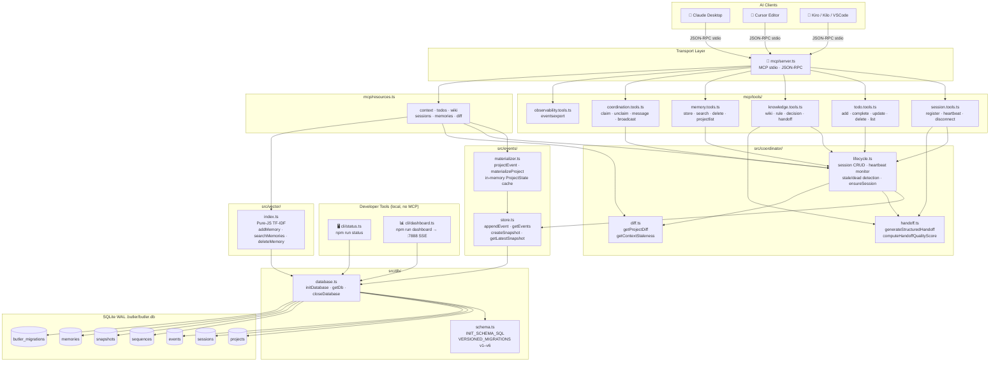

# 🌐 Butler


> **Persistent Coordination and Memory Layer for AI Coding Agents.**
>
> *"Simple like Git. Persistent like Notion. Collaborative like Figma. AI-Native like Cursor."*

---

[](#)
[](#)
[](#)
[](#)
[](#)

---

## 📑 Table of Contents

- [Butler in 3 Minutes](#-butler-in-3-minutes)
- [Quickstart](#-quickstart)
- [System Architecture](#️-system-architecture)
- [The Killer Demo](#-the-killer-demo-cross-client-session-continuity)
- [Core Terminology](#-core-terminology)
- [API & Tool Surface](#-api--tool-surface)
  - [Resources](#resources)
  - [Session Management](#session-management)
  - [Task Management](#task-management)
  - [Multi-Agent Coordination](#multi-agent-coordination)
  - [Knowledge & Memory](#knowledge--memory)
  - [Observability](#observability)
- [Developer CLI](#️-developer-cli)
- [Butler Workflow Skill](#-butler-workflow-skill)
- [Context Freshness & Staleness](#-context-freshness--staleness)
- [Multi-Agent Conflict Detection](#-multi-agent-conflict-detection)
- [Schema Migration](#️-schema-migration)
- [Multi-Agent Orchestration & LangGraph Integration](#-multi-agent-orchestration--langgraph-integration)
- [Repository Anatomy](#-repository-anatomy)
- [Principles](#-principles)
- [Related Projects](#-related-projects)

---

## ⚡ Butler in 3 Minutes

### What is Butler?
Butler is a lightweight, local-first background coordination engine that registers active AI agents (e.g. Claude Desktop, Cursor, custom IDE tools) and maintains a **shared, event-sourced memory space** directly inside your project repository.

### Why does it exist?
Coding agents are fundamentally **amnesiac**. When Cursor reloads or a process exits, active context (TODOs, architectural constraints, session differences) is completely lost. When multiple agents run concurrently, they operate in silos, generating race conditions and divergent branches. Butler bridges this gap.

### Who is it for?
*   **AI Pair Programmers:** Developers working interchangeably across multiple LLM clients (e.g., planning in Claude, implementing in Cursor).
*   **Multi-Agent Workspaces:** Teams running concurrent background AI workers on the same repository.
*   **Local-First Advocates:** Engineers seeking zero network leakages and absolute privacy.

### Why not alternatives?
| Dimension | Butler | Plain Text Files (`context.txt`) | Heavy DBs (Postgres/Redis) |
| :--- | :--- | :--- | :--- |
| **Portability** | 0-Click Local SQLite | Hard to version-control safely | Complex Docker setup |
| **State Conflict** | Optimistic Lock Versions | Prone to complete overrides | Manual locks required |
| **Recovery** | Ephemeral heartbeats & handoffs | None (static data) | Complex event logs |
| **Context Size** | Materialized incremental views | Massive raw token bloat | Ad-hoc query builds |

---

## ⏱️ Quickstart in 60 Seconds

### 1. Clone:
```bash
git clone https://github.com/Teycir/Butler.git
cd Butler
```

### 2. Install — choose your method:

#### Option A: Automatic installer (recommended)

**Linux / macOS:**
```bash
bash install/install.sh
```

**Windows (PowerShell):**
```powershell
.\install\install.ps1
```

The installer will:
- Build Butler from source
- Deploy the release to `~/Mcp/butler-mcp/`
- Auto-configure **Claude Desktop**, **Kiro CLI**, **Kilo Code**, **VS Code**, and **Cursor**

> **Custom DB path:** `bash install/install.sh --db-path /your/path/butler.db`

#### Option B: Manual setup

```bash
npm install
npm run build
```

Then add Butler to your AI client's MCP config manually:

```json
{
  "mcpServers": {
    "butler": {
      "command": "node",
      "args": ["/absolute/path/to/Butler/dist/index.js"],
      "env": {
        "BUTLER_DB_PATH": "/absolute/path/to/butler.db"
      }
    }
  }
}
```

Config file locations:
- **Claude Desktop (Linux):** `~/.config/Claude/claude_desktop_config.json`
- **Claude Desktop (macOS):** `~/Library/Application Support/Claude/claude_desktop_config.json`
- **Claude Desktop (Windows):** `%APPDATA%\Claude\claude_desktop_config.json`
- **VS Code / Cursor:** `mcp.json` in your user settings directory
- **Kiro CLI:** `~/.config/kiro-cli/mcp.json`
- **Kilo Code:** `~/.config/Antigravity/User/globalStorage/kilocode.kilo-code/settings/mcp_settings.json`

Restart your AI clients and Butler is ready.

---

## 🌟 The Core Vision

Coding agents today are incredibly powerful but fundamentally **amnesiac**. When your Cursor window reloads or Claude Desktop restarts, your active context, developer constraints, completed tasks, and architectural decisions are erased. 

Even worse, when **multiple agents work on the same codebase simultaneously**, they operate in completely disjoint silos, causing race conditions, diverging implementations, and broken handoffs.

Butler bridges this gap by acting as a local, background **Durable Project Memory Log**:

```text
               🤖 Agent A (Claude)        🤖 Agent B (Cursor)
                       \                      /
                        \                    /
                 [ Model Context Protocol stdio transport ]
                                    ↓
                       ===========================
                       │         BUTLER          │
                       │  Durable Shared Memory  │
                       ===========================
                       /      │           │      \
                     /        │           │        \
                    ▼         ▼           ▼         ▼
                🎯 TODOs   📜 Rules   💡 Decisions  📚 Wiki
```

---

## 🧠 Core Terminology

To understand Butler in under two minutes, here are our core conceptual models:

*   **Project:** The permanent codebase workspace. Lives forever, anchored by a local-first SQLite file (`.butler/butler.db`).
*   **Session:** An ephemeral window of activity by a specific AI client (e.g. `cursor-1`, `claude-desktop-2`). Sessions send periodic heartbeats to prove presence.
*   **Event:** An append-only, immutable transaction log entry representing a discrete state change (e.g. `TODO_CREATED`, `RULE_ADDED`, `WIKI_UPDATED`). **Events are the ground truth.**
*   **State:** A materialized cache of the project's current status (active tasks, wiki pages, rules) constructed incrementally by playing events. **State is the cache.**
*   **Handoff:** A structured, context-rich handoff payload generated when a session disconnects, capturing exact achievements and pending blockers.
*   **Memory:** Highly searchable semantic guidelines, observations, and design logs indexed locally using light, zero-click Term Frequency-Inverse Document Frequency (TF-IDF) sparse relevance algorithms.

---

## 🏗️ System Architecture

Butler is designed to be operationally invisible and incredibly fast. It operates on an **event-sourced, materialized-view model** backed by SQLite in Write-Ahead Log (WAL) mode.



---

## 🔄 The Killer Demo: cross-client session continuity

Imagine this workflow:

1.  **Start in Cursor:** You ask Cursor to plan a database migration. Cursor registers a session, creates 3 TODOs, and records a design decision (`ADR-001`).
2.  **Cursor Window Reloads / Crashes:** The Cursor session terminates. Butler detects the disconnection, automatically materializes a structured handoff marker, and updates the event log.
3.  **Resume in Claude Desktop:** You open Claude Desktop. Claude registers its session.
4.  **Instant Rehydration:** Claude reads the `butler://projects/{id}/context` resource. It instantly receives:
    *   The structured handoff summarizing Cursor's accomplishments.
    *   The exact pending TODO list.
    *   The active project rules and architectural constraints.
    Claude immediately resumes work with **zero lost context**.

---

## ⚡ Quickstart

### 1. Installation
```bash
git clone https://github.com/Teycir/Butler.git
cd Butler
```

**Linux / macOS:**
```bash
bash install/install.sh
```

**Windows (PowerShell):**
```powershell
.\install\install.ps1
```

The installer builds Butler, deploys the release to `~/Mcp/butler-mcp/`, and auto-configures Claude Desktop, Kiro CLI, Kilo Code, VS Code, and Cursor. Restart your AI clients and Butler is ready.

> **Custom DB path:** `bash install/install.sh --db-path /your/path/butler.db`

### 2. Zero-Config Project Default

Drop a `.butler/project.json` in your repo root to set a default project for all tool calls:

```json
{ "project_id": "my-project" }
```

Butler walks up the directory tree to find this file automatically. Once set, every tool call in that workspace resolves `project_id` without you passing it explicitly.

### 3. Run the Verification Suite
```bash
npm test
```

---

## 🔌 API & Tool Surface

### Resources

| URI | Description |
| :--- | :--- |
| `butler://projects/{id}/context` | Unified markdown context packet: TODOs, rules, decisions, wiki, sessions, handoffs, messages, broadcasts, and auto-surfaced relevant memories. Includes a `🟢/🔴` freshness badge and staleness metadata. |
| `butler://projects/{id}/todos` | Materialized active task list (JSON). |
| `butler://projects/{id}/wiki` | Shared wiki and reference documents (JSON). |
| `butler://projects/{id}/sessions` | Active and stale session registry (JSON). |
| `butler://projects/{id}/memories` | Complete project memory log (JSON). |
| `butler://projects/{id}/diff?since={eventId}` | Compact changelog of all state changes since a given event ID, grouped by type. |

### Tools

#### Session Management
| Tool | Description |
| :--- | :--- |
| `sessionregister` | Bind an active client session. Idempotent — reconnecting agents reuse their session. |
| `sessionheartbeat` | Signal presence every 15 seconds to stay alive in shared context. |
| `sessiondisconnect` | Gracefully disconnect and broadcast a structured continuity handoff. |

#### Task Management
| Tool | Description |
| :--- | :--- |
| `todoadd` | Create a task with priority (`low`/`medium`/`high`) and optimistic version locking. |
| `todocomplete` | Mark a task done with conflict detection against concurrent mutations. |
| `todoupdate` | Update a TODO's title, priority, or status with version checking. |
| `tododelete` | Delete a TODO with optimistic version checking. |
| `todolist` | List all TODOs for a project (filterable by `pending`/`completed`/`all`). |

#### Multi-Agent Coordination
| Tool | Description |
| :--- | :--- |
| `todoclaim` | Claim a TODO as actively being worked. Other agents see it as 🔒 in-progress. Claims expire when the session goes stale. |
| `todounclaim` | Release a claim, making the TODO available again. |
| `messagesend` | Send a direct message to another active session (stored in event log; delivered on reconnect). |
| `broadcast` | Announce something to all active sessions — visible in every agent's next context read under 📢 Broadcasts. |

#### Knowledge & Memory
| Tool | Description |
| :--- | :--- |
| `wikiupdate` | Create or update a wiki knowledge base page. |
| `ruleadd` | Add a persistent coding guideline all agents must follow. |
| `ruleremove` | Remove a persistent guideline by ID. |
| `decisionrecord` | Log an architectural decision record (ADR) with context and outcome. |
| `handoffcreate` | Explicitly broadcast a session handoff. Includes quality scoring (0–100%) with inline coaching feedback. |
| `memorystore` | Store a semantic project memory (type: `summary`, `decision`, `rule`, `wiki`). |
| `memorysearch` | Search project memory using hybrid TF-IDF keyword + recency ranking. |
| `memorydelete` | Delete a memory by ID to remove stale or incorrect information. |
| `projectlist` | List all projects in the Butler database. |

#### Observability
| Tool | Description |
| :--- | :--- |
| `eventsexport` | Export the raw event log as `json` (array) or `ndjson` (newline-delimited). Supports `since`, `until`, `session_id`, `event_type`, and `limit` filters. Default 500, max 5000 events. |

---

## 🖥️ Developer CLI

Butler ships two local CLI commands — no MCP server required.

### `npm run status`

Reads `.butler/butler.db` directly and prints a live terminal summary:
- Active sessions (alive / stale) with last heartbeat times
- Open TODOs grouped by priority
- Recent handoffs and their quality scores
- Conflict log and broadcast history
- Event log stats and snapshot info

Supports `--project <id>`, `--db <path>`, `--json`, and `--help` flags. `--json` emits structured output for piping into `jq` or external tooling.

### `npm run dashboard`

Starts a local read-only web dashboard at `http://localhost:7888`:
- Live SSE push every 5 seconds — zero page refresh
- Session heartbeat status, open TODOs with priority and claim indicators
- Broadcasts, conflict warnings, and a scrolling 30-event log
- Purely observational — zero writes through the UI

Supports `--port <n>`, `--host <addr>`, and `--db <path>` flags.

---

## 🧩 Butler Workflow Skill

Butler includes a portable skill package that teaches AI agents how to use Butler's coordination features effectively. The skill is available in `skills/butler-workflow/`.

### Installation

**For Kiro CLI / Kilo Code / Claude Code:**
```bash
cp -r skills/butler-workflow ~/.kiro/skills/
# or
cp -r skills/butler-workflow ~/.agents/skills/
```

**For other agents:**
Copy the skill to your agent's skill directory and it will be auto-loaded on startup.

### What the Skill Teaches

The `butler-workflow` skill provides comprehensive patterns for:

- **Session Lifecycle:** Register → heartbeat → handoff → disconnect
- **TODO Workflow:** Create → claim → work → complete with conflict prevention
- **Memory Management:** Store decisions, search context, clean up stale data
- **Multi-Agent Coordination:** Messages, broadcasts, conflict detection
- **Best Practices:** When to register, how to handoff, what to persist

### Usage

Once installed, agents automatically learn Butler patterns. The skill teaches agents to:

1. Register sessions at startup with unique session IDs
2. Send heartbeats every 15-30 seconds during active work
3. Claim TODOs before starting to prevent conflicts
4. Store important decisions with appropriate importance scores
5. Create quality handoffs when switching contexts
6. Coordinate with other active sessions via messages

See `skills/butler-workflow/SKILL.md` for full documentation and examples.

---

## 🔍 Context Freshness & Staleness

Every `/context` read opens with a freshness badge:

- `🟢` — at least one session is alive and actively heartbeating
- `🔴` — no live sessions; context was last updated some time ago

The raw JSON payload (second content block on `/context`) also includes a `staleness` object:

```json
{
  "last_live_heartbeat": 1716900000,
  "has_live_session": false,
  "events_since_last_read": 12,
  "context_age_seconds": 720
}
```

Agents reconnecting after a gap can use `last_event_id` + the `/diff` resource to fetch only what changed, rather than re-reading the full context.

---

## 🤝 Multi-Agent Conflict Detection

When two sessions complete or update the same TODO within a 10-second window, Butler appends a `TODO_CONFLICT` event alongside the mutation. These conflicts surface in the `/context` resource under **⚡ Recent Coordination Conflicts**, letting all agents see where parallel writes collided and coordinate resolution.

---

## 🗄️ Schema Migration

Butler uses a versioned migration runner backed by a `butler_migrations` tracking table. Each migration:
- Runs inside a transaction — failure rolls back cleanly
- Is idempotent — applied exactly once, never re-run
- Records version number, description, and `applied_at` timestamp

The `VERSIONED_MIGRATIONS` array in `schema.ts` is the single source of truth. Pre-existing databases are automatically brought up to date on startup.

---

## 🤖 Multi-Agent Orchestration & LangGraph Integration

Butler features first-class integration with [LangGraph](https://github.com/langchain-ai/langgraphjs) to support complex, multi-step agent orchestration workflows (such as Planning ➔ Implementing ➔ Verifying ➔ Committing). 

### LangGraph Checkpointer
Butler provides a custom LangGraph checkpointer (`getLangGraphCheckpointer()`) that utilizes your existing `better-sqlite3` database to save and restore agent checkpoint states and conversation threads. This avoids the need to maintain a separate SQLite checkpointer file for LangGraph.

To fetch the checkpointer instance:
```typescript
import { getLangGraphCheckpointer } from './dist/langgraph/checkpointer.js';
const checkpointer = getLangGraphCheckpointer();
```

The checkpointer stores thread state in the `checkpoints` and `writes` tables, automatically managed under the same WAL-journaled database as the event log.

### Simulated Agent Orchestrator
Butler includes a built-in multi-agent state graph definition (`OrchestratorState` / `buildOrchestratorGraph`) to coordinate actions between different developer agents (e.g. Antigravity/Agy planning, Kiro CLI implementing, OpenCode verifying). The orchestrator uses LangGraph interrupts to pause execution until tasks are completed and marked complete in the Butler event log.

---

## 📂 Repository Anatomy

```text
Butler/
├── src/
│   ├── db/            # SQLite connection pool, WAL mode, versioned schema migrations
│   ├── events/        # Event store (append-only log), materializer, snapshots
│   ├── coordinator/   # Heartbeat registry, session lifecycle, handoff quality scoring
│   ├── vector/        # Pure-JS TF-IDF sparse memory indexer + cosine similarity
│   ├── mcp/
│   │   ├── server.ts                    # MCP stdio transport, routing, auto-registration
│   │   ├── resources.ts                 # context, todos, wiki, sessions, memories, diff
│   │   └── tools/
│   │       ├── session.tools.ts         # sessionregister, sessionheartbeat, sessiondisconnect
│   │       ├── todo.tools.ts            # todoadd, todocomplete, todoupdate, tododelete, todolist
│   │       ├── knowledge.tools.ts       # wikiupdate, ruleadd, ruleremove, decisionrecord, handoffcreate
│   │       ├── memory.tools.ts          # memorystore, memorysearch, memorydelete, projectlist
│   │       ├── coordination.tools.ts    # todoclaim, todounclaim, messagesend, broadcast
│   │       └── observability.tools.ts   # eventsexport
│   ├── cli/
│   │   ├── status.ts      # `npm run status` — terminal project summary
│   │   └── dashboard.ts   # `npm run dashboard` — local SSE web dashboard
│   ├── project-config.ts  # .butler/project.json discovery (walks up directory tree)
│   ├── validation.ts
│   └── index.ts           # Application entry point
├── tests/
│   └── integration.test.ts
├── skills/            # Portable agent skill packages
│   └── butler-workflow/   # Butler coordination patterns for AI agents
├── docs/              # Architecture, concepts, changelog, recovery guides
├── install/           # install.sh / install.ps1 — build + multi-client auto-config
├── package.json
└── tsconfig.json
```

---

## 📜 Principles

*   **Events are Truth, State is Cache:** We reconstruct project models deterministically by replaying event logs.
*   **0-Clicks Portability:** Vector indexers run on pure JavaScript TF-IDF token matching, eliminating the need for Python packages, heavy vector databases, or paid API keys.
*   **Invisible Ergonomics:** The user never manages memory. The system simply remembers.
*   **Active Contribution, Not Passive Reading:** Butler's server instructions coach every agent to write decisions, TODOs, rules, and handoffs — not just consume them. The shared brain only works if everyone feeds it.

---

<!-- donation:eth:start -->
<div align="center">

## Support Development

If this project helps your work, support ongoing maintenance and new features.

**ETH Donation Wallet**  
`0x11282eE5726B3370c8B480e321b3B2aA13686582`

<a href="https://etherscan.io/address/0x11282eE5726B3370c8B480e321b3B2aA13686582">
  
</a>

_Scan the QR code or copy the wallet address above._

</div>
<!-- donation:eth:end -->

---

## 🌐 Related Projects

Explore more privacy-first and security tools:

### Privacy & Encryption
- **[Timeseal](https://github.com/Teycir/Timeseal)** - Time-locked encryption vault with Dead Man's Switch. AES-256 split-key crypto, ephemeral seals.
- **[Sanctum](https://github.com/Teycir/Sanctum)** - Zero-trust encrypted vault with cryptographic plausible deniability. XChaCha20-Poly1305, Argon2id.
- **[GhostChat](https://github.com/Teycir/GhostChat)** - True P2P encrypted chat via WebRTC. No servers, no storage, self-destructing messages.
- **[xmrproof](https://github.com/Teycir/xmrproof)** - Monero payment verification, 100% client-side.
- **[GhostReceipt](https://github.com/Teycir/GhostReceipt)** - Anonymous receipt generation with zero-knowledge proofs.

### Security Tools
- **[BurpAPISecuritySuite](https://github.com/Teycir/BurpAPISecuritySuite)** - Burp Suite extension for API security testing. 15 attack types, 108+ payloads, BOLA/IDOR detection.
- **[Mcpwn](https://github.com/Teycir/Mcpwn)** - Automated security scanner for Model Context Protocol servers. Detects RCE, path traversal, prompt injection.
- **[DiffCatcher](https://github.com/Teycir/DiffCatcher)** - Git repo discovery, diff capture, code element extraction.
- **[HoneypotScan](https://github.com/Teycir/HoneypotScan)** - Honeypot detection service for security research.
- **[CheckAPI](https://github.com/Teycir/CheckAPI)** - LLM API key validator for multiple providers. Privacy-first, client-side validation.
- **[SeekYou](https://github.com/Teycir/SeekYou)** - Host intelligence aggregator — unified OSINT across 15 sources for IPs, domains, and ASNs.

### MCP Security Servers
- **[burp-mcp-server](https://github.com/Teycir/burp-mcp-server)** - MCP server for Burp Suite Professional. Vulnerability scanning via AI assistants.
- **[nuclei-mcp](https://github.com/Teycir/nuclei-mcp)** - MCP server for Nuclei. Multi-target scanning, severity filtering.
- **[nmap-mcp](https://github.com/Teycir/nmap-mcp)** - MCP server for Nmap. Stealth recon, vuln/NSE scanning.
- **[frida-mcp](https://github.com/Teycir/frida-mcp)** - MCP server for Frida. Dynamic instrumentation, SSL pinning bypass.

---

## 💼 Services Offered

- 🔒 **Privacy-First Development** - P2P applications, encrypted communication, zero-knowledge systems
- 🚀 **Web Application Development** - Full-stack development with Next.js, React, TypeScript
- 🔧 **Edge Computing Solutions** - Cloudflare Workers, Pages, D1, KV, Durable Objects
- 🛡️ **Security Tool Development** - Burp extensions, penetration testing tools, automation frameworks
- 🤖 **AI Integration** - LLM-powered applications, intelligent automation, custom AI solutions
- 🔍 **OSINT & Threat Intelligence** - Custom reconnaissance tools, threat feed aggregation, IOC correlation

**Get in Touch**: [teycirbensoltane.tn](https://teycirbensoltane.tn) | Available for freelance projects and consulting

---

## 📄 License

MIT License

Copyright (c) 2026 Teycir Ben Soltane

Permission is hereby granted, free of charge, to any person obtaining a copy
of this software and associated documentation files (the "Software"), to deal
in the Software without restriction, including without limitation the rights
to use, copy, modify, merge, publish, distribute, sublicense, and/or sell
copies of the Software, and to permit persons to whom the Software is
furnished to do so, subject to the following conditions:

The above copyright notice and this permission notice shall be included in all
copies or substantial portions of the Software.

THE SOFTWARE IS PROVIDED "AS IS", WITHOUT WARRANTY OF ANY KIND, EXPRESS OR
IMPLIED, INCLUDING BUT NOT LIMITED TO THE WARRANTIES OF MERCHANTABILITY,
FITNESS FOR A PARTICULAR PURPOSE AND NONINFRINGEMENT. IN NO EVENT SHALL THE
AUTHORS OR COPYRIGHT HOLDERS BE LIABLE FOR ANY CLAIM, DAMAGES OR OTHER
LIABILITY, WHETHER IN AN ACTION OF CONTRACT, TORT OR OTHERWISE, ARISING FROM,
OUT OF OR IN CONNECTION WITH THE SOFTWARE OR THE USE OR OTHER DEALINGS IN THE
SOFTWARE.

---

## Author

**Teycir Ben Soltane**  
Email: teycir@pxdmail.net  
GitHub: [@Teycir](https://github.com/Teycir)

---

<div align="center">

**Built with 💚 by [Teycir Ben Soltane](https://teycirbensoltane.tn)**

</div>
