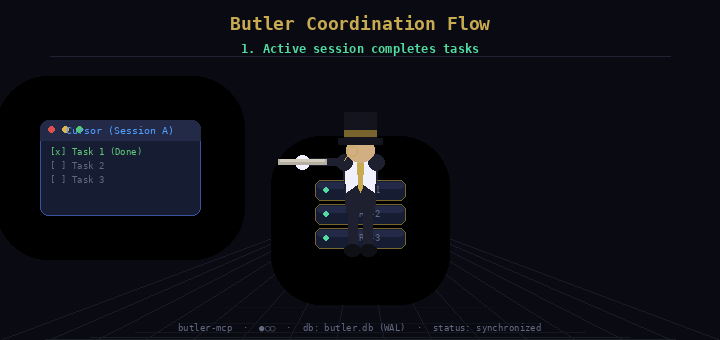
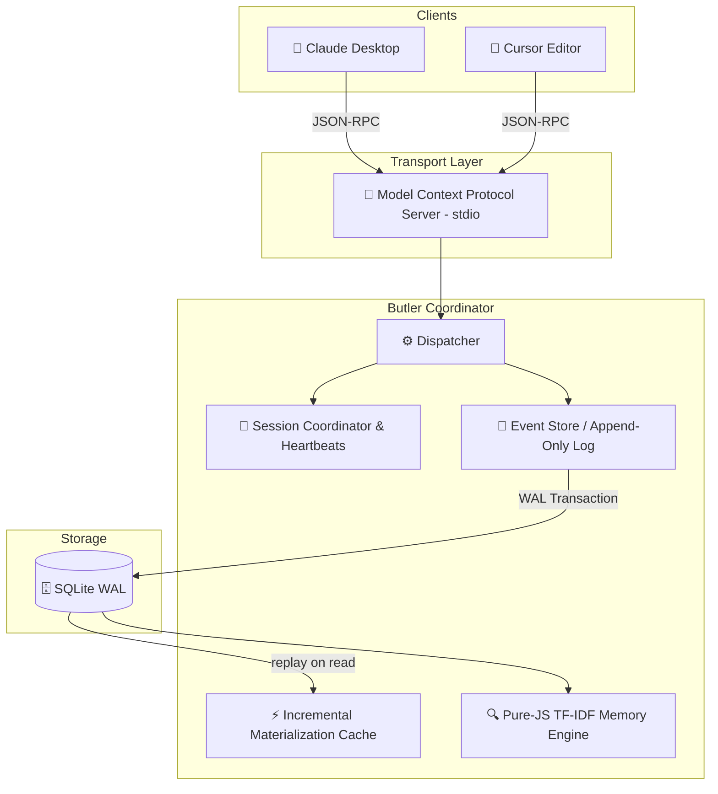

# 🌐 Butler



> **Persistent Coordination and Memory Layer for AI Coding Agents.**
>
> *“Simple like Git. Persistent like Notion. Collaborative like Figma. AI-Native like Cursor.”*

---

[](#)
[](#)
[](#)
[](#)
[](#)

---

## ⚡ Butler in 3 Minutes

### What is Butler?
Butler is a lightweight, local-first background coordination engine that registers active AI agents (e.g. Claude Desktop, Cursor, custom IDE tools) and maintains a **shared, event-sourced memory space** directly inside your project repository.

### Why does it exist?
Coding agents are fundamentally **amnesiac**. When Cursor reloads or a process exits, active context (TODOs, architectural constraints, session differences) is completely lost. When multiple agents run concurrently, they operate in silos, generating race conditions and divergent branches. Butler bridges this gap.

### Who is it for?
*   **AI Pair Programmers:** Developers working interchangeably across multiple LLM clients (e.g., planning in Claude, implementing in Cursor).
*   **Multi-Agent Workspaces:** Teams running concurrent background AI workers on the same repository.
*   **Local-First Advocates:** Engineers seeking zero network leakages and absolute privacy.

### Why not alternatives?
| Dimension | Butler | Plain Text Files (`context.txt`) | Heavy DBs (Postgres/Redis) |
| :--- | :--- | :--- | :--- |
| **Portability** | 0-Click Local SQLite | Hard to version-control safely | Complex Docker setup |
| **State Conflict** | Optimistic Lock Versions | Prone to complete overrides | Manual locks required |
| **Recovery** | Ephemeral heartbeats & handoffs | None (static data) | Complex event logs |
| **Context Size** | Materialized incremental views | Massive raw token bloat | Ad-hoc query builds |

---

## ⏱️ Quickstart in 60 Seconds

### 1. Boot the server and run the test suite:
```bash
npm install
npm test
```

### 2. Build and connect to your agent:
```bash
npm run build
```
Then add this to your Claude Desktop config (e.g., `~/.config/Claude/claude_desktop_config.json`):
```json
{
  "mcpServers": {
    "butler": {
      "command": "node",
      "args": ["/absolute/path/to/Butler/dist/index.js"],
      "env": {
        "BUTLER_DB_PATH": ".butler/butler.db"
      }
    }
  }
}
```

---

## 🌟 The Core Vision

Coding agents today are incredibly powerful but fundamentally **amnesiac**. When your Cursor window reloads or Claude Desktop restarts, your active context, developer constraints, completed tasks, and architectural decisions are erased. 

Even worse, when **multiple agents work on the same codebase simultaneously**, they operate in completely disjoint silos, causing race conditions, diverging implementations, and broken handoffs.

Butler bridges this gap by acting as a local, background **Durable Project Memory Log**:

```text
               🤖 Agent A (Claude)        🤖 Agent B (Cursor)
                       \                      /
                        \                    /
                 [ Model Context Protocol stdio transport ]
                                    ↓
                       ===========================
                       │         BUTLER          │
                       │  Durable Shared Memory  │
                       ===========================
                       /      │           │      \
                     /        │           │        \
                    ▼         ▼           ▼         ▼
                🎯 TODOs   📜 Rules   💡 Decisions  📚 Wiki
```

---

## 🧠 Core Terminology

To understand Butler in under two minutes, here are our core conceptual models:

*   **Project:** The permanent codebase workspace. Lives forever, anchored by a local-first SQLite file (`.butler/butler.db`).
*   **Session:** An ephemeral window of activity by a specific AI client (e.g. `cursor-1`, `claude-desktop-2`). Sessions send periodic heartbeats to prove presence.
*   **Event:** An append-only, immutable transaction log entry representing a discrete state change (e.g. `TODO_CREATED`, `RULE_ADDED`, `WIKI_UPDATED`). **Events are the ground truth.**
*   **State:** A materialized cache of the project's current status (active tasks, wiki pages, rules) constructed incrementally by playing events. **State is the cache.**
*   **Handoff:** A structured, context-rich handoff payload generated when a session disconnects, capturing exact achievements and pending blockers.
*   **Memory:** Highly searchable semantic guidelines, observations, and design logs indexed locally using light, zero-click Term Frequency-Inverse Document Frequency (TF-IDF) sparse relevance algorithms.

---

## 🏗️ Revised System Architecture

Butler is designed to be operationally invisible and incredibly fast. It operates on an **event-sourced, materialized-view model** backed by SQLite in Write-Ahead Log (WAL) mode.



---

## 🔄 The Killer Demo: cross-client session continuity

Imagine this workflow:

1.  **Start in Cursor:** You ask Cursor to plan a database migration. Cursor registers a session, creates 3 TODOs, and records a design decision (`ADR-001`).
2.  **Cursor Window Reloads / Crashes:** The Cursor session terminates. Butler detects the disconnection, automatically materializes a structured handoff marker, and updates the event log.
3.  **Resume in Claude Desktop:** You open Claude Desktop. Claude registers its session.
4.  **Instant Rehydration:** Claude reads the `butler://projects/{id}/context` resource. It instantly receives:
    *   The structured handoff summarizing Cursor's accomplishments.
    *   The exact pending TODO list.
    *   The active project rules and architectural constraints.
    Claude immediately resumes work with **zero lost context**.

---

## ⚡ Quickstart

### 1. Installation
Clone the repository and install dependencies locally.
```bash
git clone https://github.com/Teycir/Butler.git
cd Butler
npm install
```

### 2. Run the Verification Suite
Butler features an advanced integration test suite validating SQLite concurrency, atomic sequences, incremental caching, and vector indexing:
```bash
npm test
```

### 3. Connect to Claude Desktop
Add Butler as an MCP server in your Claude Desktop configuration file (e.g. `~/.config/Claude/claude_desktop_config.json`):
```json
{
  "mcpServers": {
    "butler": {
      "command": "node",
      "args": ["/absolute/path/to/Butler/dist/index.js"],
      "env": {
        "BUTLER_DB_PATH": ".butler/butler.db"
      }
    }
  }
}
```

---

## 🔌 API & Tool Surface

### 1. Resources
*   `butler://projects/{projectId}/context`: Unified markdown context packet containing TODOs, rules, wiki pages, active sessions, and recent handoffs.
*   `butler://projects/{projectId}/todos`: Materialized active task list.
*   `butler://projects/{projectId}/wiki`: Shared wiki and reference documents.
*   `butler://projects/{projectId}/sessions`: Active and stale session registry.
*   `butler://projects/{projectId}/memories`: Complete universal project memory log.

### 2. Core Tools
*   `session.register`: Bind an active client session.
*   `session.heartbeat`: Periodically signal presence (every 15s).
*   `session.disconnect`: Gracefully disconnect and broadcast a structured continuity handoff.
*   `todo.add` / `todo.complete`: Add and complete tasks with optimistic version locking.
*   `wiki.update`: Create or update a wiki knowledge base page.
*   `rule.add`: Add a persistent coding guideline all agents must follow.
*   `decision.record`: Log an architectural decision record (ADR).
*   `handoff.create`: Explicitly broadcast a session handoff with accomplishments and pending work.
*   `memory.store` / `memory.search`: Store and search project memory using hybrid TF-IDF keyword ranking.

---

## 📂 Repository Anatomy

```text
Butler/
├── src/
│   ├── db/            # SQLite connection pool, WAL mode, schema initializations
│   ├── events/        # Event store (append-only logs), materialized view, snapshots
│   ├── coordinator/   # Heartbeat registry, session lifecycle monitor, handoffs
│   ├── vector/        # Cosine similarity and pure-JS TF-IDF sparse memory indexer
│   ├── mcp/           # Model Context Protocol stdio transport & tools wrapper
│   └── index.ts       # Application entry point
├── tests/
│   └── integration.test.ts
├── docs/              # In-depth architectural & workflow details
├── package.json
└── tsconfig.json
```

---

## 📜 Principles

*   **Events are Truth, State is Cache:** We reconstruct project models deterministically by replaying event logs. 
*   **0-Clicks Portability:** Vector indexers run on pure JavaScript TF-IDF token matching, eliminating the need for Python packages, heavy vector databases, or paid API keys.
*   **Invisible Ergonomics:** The user never manages memory. The system simply remembers.

---

<!-- donation:eth:start -->
<div align="center">

## Support Development

If this project helps your work, support ongoing maintenance and new features.

**ETH Donation Wallet**  
`0x11282eE5726B3370c8B480e321b3B2aA13686582`

<a href="https://etherscan.io/address/0x11282eE5726B3370c8B480e321b3B2aA13686582">
  
</a>

_Scan the QR code or copy the wallet address above._

</div>
<!-- donation:eth:end -->

---

## 🌐 Related Projects

Explore more privacy-first and security tools:

### Privacy & Encryption
- **[Timeseal](https://github.com/Teycir/Timeseal)** - Time-locked encryption vault with Dead Man's Switch. AES-256 split-key crypto, ephemeral seals.
- **[Sanctum](https://github.com/Teycir/Sanctum)** - Zero-trust encrypted vault with cryptographic plausible deniability. XChaCha20-Poly1305, Argon2id.
- **[GhostChat](https://github.com/Teycir/GhostChat)** - True P2P encrypted chat via WebRTC. No servers, no storage, self-destructing messages.
- **[xmrproof](https://github.com/Teycir/xmrproof)** - Monero payment verification, 100% client-side.
- **[GhostReceipt](https://github.com/Teycir/GhostReceipt)** - Anonymous receipt generation with zero-knowledge proofs.

### Security Tools
- **[BurpAPISecuritySuite](https://github.com/Teycir/BurpAPISecuritySuite)** - Burp Suite extension for API security testing. 15 attack types, 108+ payloads, BOLA/IDOR detection.
- **[Mcpwn](https://github.com/Teycir/Mcpwn)** - Automated security scanner for Model Context Protocol servers. Detects RCE, path traversal, prompt injection.
- **[DiffCatcher](https://github.com/Teycir/DiffCatcher)** - Git repo discovery, diff capture, code element extraction.
- **[HoneypotScan](https://github.com/Teycir/HoneypotScan)** - Honeypot detection service for security research.
- **[CheckAPI](https://github.com/Teycir/CheckAPI)** - LLM API key validator for multiple providers. Privacy-first, client-side validation.
- **[SeekYou](https://github.com/Teycir/SeekYou)** - Host intelligence aggregator — unified OSINT across 15 sources for IPs, domains, and ASNs.

### MCP Security Servers
- **[burp-mcp-server](https://github.com/Teycir/burp-mcp-server)** - MCP server for Burp Suite Professional. Vulnerability scanning via AI assistants.
- **[nuclei-mcp](https://github.com/Teycir/nuclei-mcp)** - MCP server for Nuclei. Multi-target scanning, severity filtering.
- **[nmap-mcp](https://github.com/Teycir/nmap-mcp)** - MCP server for Nmap. Stealth recon, vuln/NSE scanning.
- **[frida-mcp](https://github.com/Teycir/frida-mcp)** - MCP server for Frida. Dynamic instrumentation, SSL pinning bypass.

---

## 💼 Services Offered

- 🔒 **Privacy-First Development** - P2P applications, encrypted communication, zero-knowledge systems
- 🚀 **Web Application Development** - Full-stack development with Next.js, React, TypeScript
- 🔧 **Edge Computing Solutions** - Cloudflare Workers, Pages, D1, KV, Durable Objects
- 🛡️ **Security Tool Development** - Burp extensions, penetration testing tools, automation frameworks
- 🤖 **AI Integration** - LLM-powered applications, intelligent automation, custom AI solutions
- 🔍 **OSINT & Threat Intelligence** - Custom reconnaissance tools, threat feed aggregation, IOC correlation

**Get in Touch**: [teycirbensoltane.tn](https://teycirbensoltane.tn) | Available for freelance projects and consulting

---

## 📄 License

MIT License

Copyright (c) 2026 Teycir Ben Soltane

Permission is hereby granted, free of charge, to any person obtaining a copy
of this software and associated documentation files (the "Software"), to deal
in the Software without restriction, including without limitation the rights
to use, copy, modify, merge, publish, distribute, sublicense, and/or sell
copies of the Software, and to permit persons to whom the Software is
furnished to do so, subject to the following conditions:

The above copyright notice and this permission notice shall be included in all
copies or substantial portions of the Software.

THE SOFTWARE IS PROVIDED "AS IS", WITHOUT WARRANTY OF ANY KIND, EXPRESS OR
IMPLIED, INCLUDING BUT NOT LIMITED TO THE WARRANTIES OF MERCHANTABILITY,
FITNESS FOR A PARTICULAR PURPOSE AND NONINFRINGEMENT. IN NO EVENT SHALL THE
AUTHORS OR COPYRIGHT HOLDERS BE LIABLE FOR ANY CLAIM, DAMAGES OR OTHER
LIABILITY, WHETHER IN AN ACTION OF CONTRACT, TORT OR OTHERWISE, ARISING FROM,
OUT OF OR IN CONNECTION WITH THE SOFTWARE OR THE USE OR OTHER DEALINGS IN THE
SOFTWARE.

---

## Author

**Teycir Ben Soltane**  
Email: teycir@pxdmail.net  
GitHub: [@Teycir](https://github.com/Teycir)

---

<div align="center">

**Built with 💚 by [Teycir Ben Soltane](https://teycirbensoltane.tn)**

</div>

