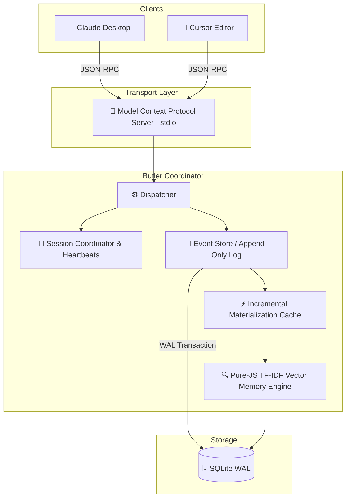

# 🌐 Butler

> **Persistent Coordination and Memory Layer for AI Coding Agents.**
>
> *“Simple like Git. Persistent like Notion. Collaborative like Figma. AI-Native like Cursor.”*

---

[](#)
[](#)
[](#)
[](#)

Butler is a lightweight, local-first, **persistent shared coordination infrastructure** designed for multi-client AI software engineering teams. It allows multiple independent LLM agents (such as Claude Desktop, Cursor, and custom IDE extensions) to safely pair-program, share context, persist memories, and naturally resume development context across editor sessions.

Sessions are temporary. **Projects are permanent.**

---

## 🌟 The Core Vision

Coding agents today are incredibly powerful but fundamentally **amnesiac**. When your Cursor window reloads or Claude Desktop restarts, your active context, developer constraints, completed tasks, and architectural decisions are erased. 

Even worse, when **multiple agents work on the same codebase simultaneously**, they operate in completely disjoint silos, causing race conditions, diverging implementations, and broken handoffs.

Butler bridges this gap by acting as a local, background **Durable Project Memory Log**:

```text
               🤖 Agent A (Claude)        🤖 Agent B (Cursor)
                       \                      /
                        \                    /
                 [ Model Context Protocol stdio transport ]
                                    ↓
                       ===========================
                       │         BUTLER          │
                       │  Durable Shared Memory  │
                       ===========================
                       /      │           │      \
                     /        │           │        \
                    ▼         ▼           ▼         ▼
                🎯 TODOs   📜 Rules   💡 Decisions  📚 Wiki
```

---

## 🧠 Core Terminology

To understand Butler in under two minutes, here are our core conceptual models:

*   **Project:** The permanent codebase workspace. Lives forever, anchored by a local-first SQLite file (`.butler/butler.db`).
*   **Session:** An ephemeral window of activity by a specific AI client (e.g. `claude-3.5-sonnet`). Sessions send periodic heartbeats to prove presence.
*   **Event:** An append-only, immutable transaction log entry representing a discrete state change (e.g. `TODO_CREATED`, `RULE_ADDED`, `WIKI_UPDATED`). **Events are the ground truth.**
*   **State:** A materialized cache of the project's current status (active tasks, wiki pages, rules) constructed incrementally by playing events. **State is the cache.**
*   **Handoff:** A structured, context-rich handoff payload generated when a session disconnects, capturing exact achievements and pending blockers.
*   **Memory:** Highly searchable semantic guidelines, observations, and design logs indexed locally using light, zero-click Term Frequency-Inverse Document Frequency (TF-IDF) sparse relevance algorithms.

---

## 🏗️ Revised System Architecture

Butler is designed to be operationally invisible and incredibly fast. It operates on an **event-sourced, materialized-view model** backed by SQLite in Write-Ahead Log (WAL) mode.



---

## 🔄 The Killer Demo: cross-client session continuity

Imagine this workflow:

1.  **Start in Cursor:** You ask Cursor to plan a database migration. Cursor registers a session, creates 3 TODOs, and records a design decision (`ADR-001`).
2.  **Cursor Window Reloads / Crashes:** The Cursor session terminates. Butler detects the disconnection, automatically materializes a structured handoff marker, and updates the event log.
3.  **Resume in Claude Desktop:** You open Claude Desktop. Claude registers its session.
4.  **Instant Rehydration:** Claude reads the `butler://projects/{id}/context` resource. It instantly receives:
    *   The structured handoff summarizing Cursor's accomplishments.
    *   The exact pending TODO list.
    *   The active project rules and architectural constraints.
    Claude immediately resumes work with **zero lost context**.

---

## ⚡ Quickstart

### 1. Installation
Clone the repository and install dependencies locally.
```bash
git clone https://github.com/Teycir/Butler.git
cd Butler
npm install
```

### 2. Run the Verification Suite
Butler features an advanced integration test suite validating SQLite concurrency, atomic sequences, incremental caching, and vector indexing:
```bash
npm test
```

### 3. Connect to Claude Desktop
Add Butler as an MCP server in your Claude Desktop configuration file (e.g. `~/.config/Claude/claude_desktop_config.json`):
```json
{
  "mcpServers": {
    "butler": {
      "command": "npx",
      "args": ["tsx", "/absolute/path/to/Butler/src/index.ts"],
      "env": {
        "BUTLER_DB_PATH": "/absolute/path/to/Butler/.butler/butler.db"
      }
    }
  }
}
```

---

## 🔌 API & Tool Surface

### 1. Resources
*   `butler://projects/{projectId}/context`: Unified markdown context packet containing TODOs, rules, wiki pages, and active sessions.
*   `butler://projects/{projectId}/todos`: Materialized active task list.
*   `butler://projects/{projectId}/wiki`: Shared wiki and reference documents.
*   `butler://projects/{projectId}/memories`: Complete universal project memory log.

### 2. Core Tools
*   `session.register`: Bind an active client session.
*   `session.heartbeat`: Periodically signal presence (every 15s).
*   `session.disconnect`: Gracefully disconnect and broadcast a structured continuity handoff.
*   `todo.add` / `todo.complete`: Add and complete tasks with optimistic version locking.
*   `rule.add` / `decision.record` / `wiki.update`: Inject rules, architectural design records, and wiki pages.
*   `memory.store` / `memory.search`: Search history using hybrid TF-IDF keyword vector ranking.

---

## 📂 Repository Anatomy

```text
Butler/
├── src/
│   ├── db/            # SQLite connection pool, WAL mode, schema initializations
│   ├── events/        # Event store (append-only logs), materialized view, snapshots
│   ├── coordinator/   # Heartbeat registry, session lifecycle monitor, handoffs
│   ├── vector/        # Cosine similarity and pure-JS TF-IDF sparse memory indexer
│   ├── mcp/           # Model Context Protocol stdio transport & tools wrapper
│   └── index.ts       # Application entry point
├── tests/
│   └── integration.test.ts
├── docs/              # In-depth architectural & workflow details
├── package.json
└── tsconfig.json
```

---

## 📜 Principles

*   **Events are Truth, State is Cache:** We reconstruct project models deterministically by replaying event logs. 
*   **0-Clicks Portability:** Vector indexers run on pure JavaScript TF-IDF token matching, eliminating the need for Python packages, heavy vector databases, or paid API keys.
*   **Invisible Ergonomics:** The user never manages memory. The system simply remembers.
