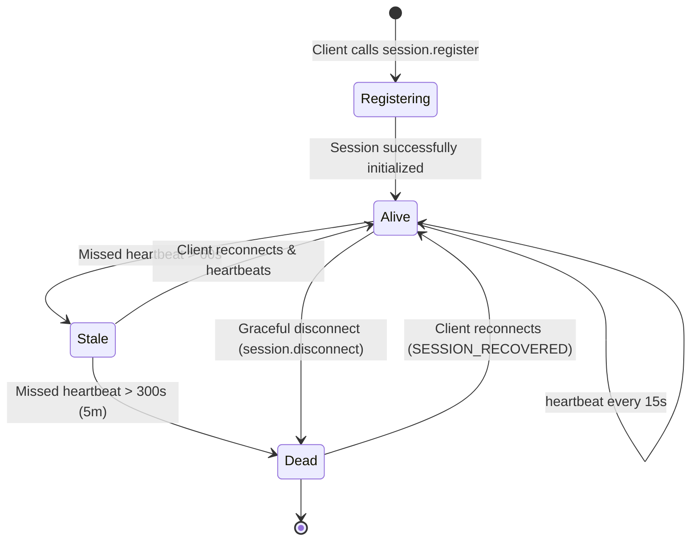

# 🧠 Butler: Core Concepts

This guide provides a comprehensive overview of the mental models and terminology used in the Butler persistence layer.

---

## 1. Projects vs. Sessions

To adopt Butler, you must first understand our most fundamental architectural split:

```text
Permanent Project (Durable memory, SQLite database, Event Logs)
  └── Ephemeral Session A (Cursor Agent window - lives for minutes)
  └── Ephemeral Session B (Claude Desktop client - lives for a session)
  └── Ephemeral Session C (CLI execution agent - lives for seconds)
```

### 🗃️ Projects (Permanent)
A **Project** is your workspace repository. It lives forever and is anchored by a local-first SQLite file (`.butler/butler.db`). 
*   It accumulates all historical logs, wiki documentation, coding rules, and design choices.
*   Even if all human developers shut down their laptops and all AI agents terminate, the Project state remains permanently intact.

### 🔌 Sessions (Ephemeral)
A **Session** is a temporary connection window created by a specific AI client.
*   Sessions are short-lived.
*   Sessions are required to announce their presence (registering) and periodically check in by emitting heartbeats.
*   A session can die gracefully (by calling `session.disconnect` before exiting) or ungracefully (by losing network connection or having the editor window crash).

---

## 2. The Shared Memory Space

Every Butler project maintains five primary shared resources. These resources represent the collective wisdom of the project and are instantly accessible to any connecting agent.

```text
                        ┌────────────────────────┐
                        │   Project Shared Area  │
                        └───────────┬────────────┘
         ┌──────────────┬───────────┼────────────┬──────────────┐
         ▼              ▼           ▼            ▼              ▼
     🎯 TODOs       📜 Rules    💡 Decisions   📚 Wiki      👤 Sessions
```

### 🎯 Shared TODOs
Instead of local in-context text task files, Butler maintains a global, materialized TODO list:
*   Tasks feature a state (`pending` or `completed`), priority (`low`, `medium`, `high`), and version count.
*   Butler uses **Optimistic Version Locking** on task completion. If Agent A attempts to complete a task, it must pass the expected version. If Agent B already completed or updated it in the background, Agent A's update is safely rejected, avoiding out-of-date writes.

### 📜 Shared Rules & Guidelines
A list of explicit architectural rules that all participating agents must obey (e.g. *"All frontend files must be written in TypeScript using standard ES modules"*). When a new agent joins the workspace, the rehydration context forces these rules directly into its prompt window.

### 💡 Architectural Decisions (ADRs)
A timeline log of key engineering choices made by cooperating agents (e.g., *"Why did we choose SQLite instead of PostgreSQL?"*). This guarantees that new or reconnected agents do not attempt to refactor work based on a lack of historical design context.

### 📚 Project Wiki
A rich markdown document knowledge base housing reference material, getting started guides, and repository documentation.

### 👤 Live Sessions
A presence directory tracking exactly which agents are currently active, their client details, and their last seen timestamp.

---

## 3. Ephemeral Session Lifecycle

Butler manages connections automatically to provide robust continuity:



1.  **Register:** An agent window loads, calls `session.register`, and announces its client type.
2.  **Heartbeat:** The agent sends a `session.heartbeat` signal every 15s to maintain an `alive` presence.
3.  **Graceful Disconnect:** When the task finishes or the user closes the window, the agent calls `session.disconnect`. Butler instantly generates a structured handoff summarizing everything completed during that window and marks the session status as `dead`.
4.  **Ungraceful Timeout:** If the agent crashes or network goes down, the heartbeat stops. After 60s, Butler flags the session as `stale`. After 5 minutes, Butler declares the session `dead`, logs an ungraceful handoff event, and alerts active peers.
