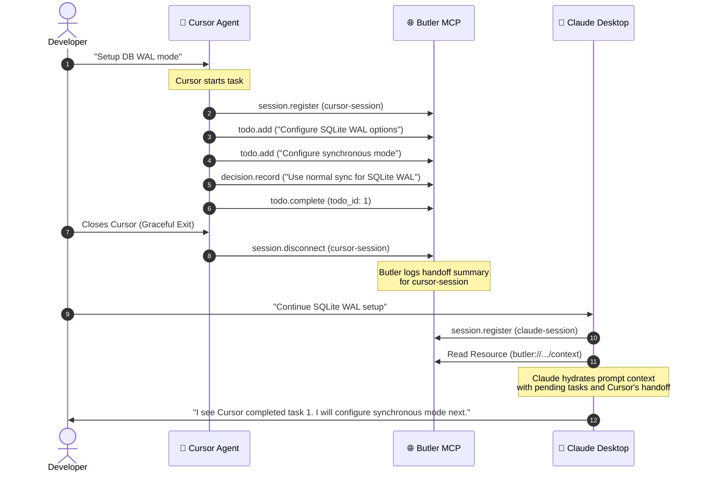
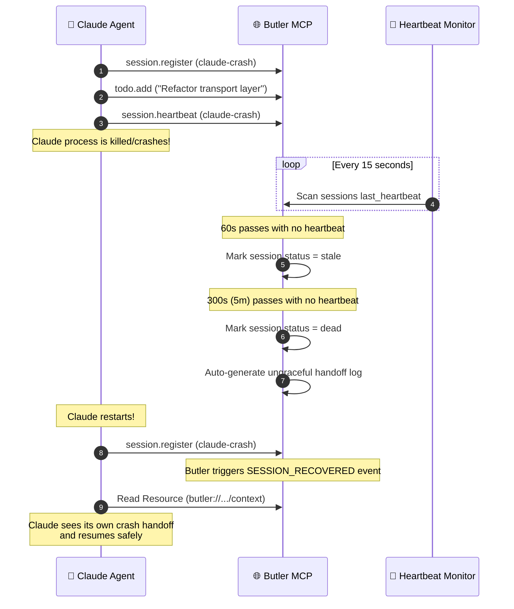

# 🔄 Butler: Session Continuity & Recovery Playbook

This document provides step-by-step walkthroughs of how Butler restores context, bridges agent crashes, and manages multi-agent handoffs with zero human intervention.

---

## Scenario A: The Live Handoff (Cursor ➔ Claude Desktop)

In this scenario, a developer starts working in Cursor, then decides to switch to Claude Desktop. Both agents use Butler to handshake.

### Step-by-Step Flow



### 1. Cursor Active Workspace
Cursor registers its session:
*   **Tool Call:** `session.register({ project_id: 'butler-repo', session_id: 'cursor-1', client_type: 'Cursor Extension' })`
*   Cursor writes a design decision:
    *   **Tool Call:** `decision.record({ project_id: 'butler-repo', session_id: 'cursor-1', decision_id: 'ADR-002', title: 'WAL SQLite Journaling', context: 'Concurrency optimization', decision: 'Enable WAL and Normal sync' })`
*   Cursor completes a task:
    *   **Tool Call:** `todo.complete({ project_id: 'butler-repo', session_id: 'cursor-1', todo_id: 1, version: 1 })`

### 2. The Graceful Disconnect
Cursor terminates gracefully when closed:
*   **Tool Call:** `session.disconnect({ project_id: 'butler-repo', session_id: 'cursor-1' })`
*   **Butler Action:** Butler catches this event, marks the session as `dead`, and runs an O(1) indexed query (`getSessionEvents`) to scan only the logs emitted by `cursor-1`.
*   **Output Handoff:**
    ```json
    {
      "session_id": "cursor-1",
      "type": "graceful",
      "created_todos": ["Configure synchronous mode (ID 2)"],
      "completed_todos": ["TODO ID 1"],
      "decisions_recorded": ["WAL SQLite Journaling: Enable WAL and Normal sync"],
      "summary": "Graceful end of session for agent cursor-1.",
      "timestamp": 1716832800
    }
    ```

### 3. Claude Rehydration
The user opens Claude Desktop and asks it to resume.
*   Claude registers: `session.register({ project_id: 'butler-repo', session_id: 'claude-1', client_type: 'Claude Desktop' })`
*   Claude queries resource: `butler://projects/butler-repo/context`
*   **Butler Rehydration Context:** Butler yields a consolidated markdown package. Claude parses the markdown:
    > "I see that `cursor-1` recently recorded a decision to use WAL with Normal sync. Task 1 ('Configure SQLite WAL options') is complete. Task 2 ('Configure synchronous mode') is still pending. I will begin work on Task 2."

---

## Scenario B: The Ungraceful Crash (Session Recovery)

In this scenario, an agent crashes or loses network connectivity mid-task. It does not have the opportunity to disconnect gracefully.

### Step-by-Step Flow



### 1. The Disappearance
An active agent (`claude-crash`) suddenly stops responding. Its 15-second heartbeat loop halts.

### 2. Timeout Declarations
Butler's active heartbeat sweep evaluates the registry:
*   **Stale transition:** 60 seconds pass. The agent's status shifts to `stale`. Butler appends a `SESSION_STALE` event.
*   **Dead transition:** 300 seconds (5 minutes) pass. The status is set to `dead`. Butler appends `SESSION_DISCONNECTED` with a timeout reason.
*   **Autogenerated Continuity Handoff:** Because the agent did not exit gracefully, Butler's state materializer compiles the ungraceful handoff. It catalogs what the agent was working on and files the state:
    ```json
    {
      "session_id": "claude-crash",
      "type": "ungraceful",
      "summary": "Session claude-crash lost connection (missed heartbeat). Auto-generated continuity marker.",
      "pending_todos": ["Refactor transport layer (ID 3)"]
    }
    ```

### 3. Clean Recovery
When the agent process recovers or the user reloads the window:
*   The agent re-registers: `session.register({ project_id: 'butler-repo', session_id: 'claude-crash', client_type: 'Claude Desktop' })`
*   Butler identifies that the session was previously dead but is now active. It logs a `SESSION_RECOVERED` event.
*   The agent reads `butler://projects/butler-repo/context`, parses the autogenerated handoff, realizes what it was working on prior to the crash, and resumes work.
