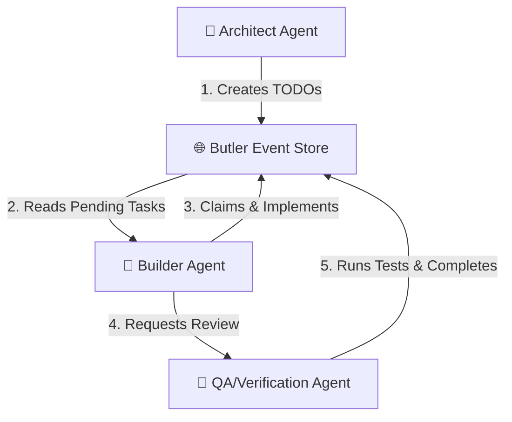
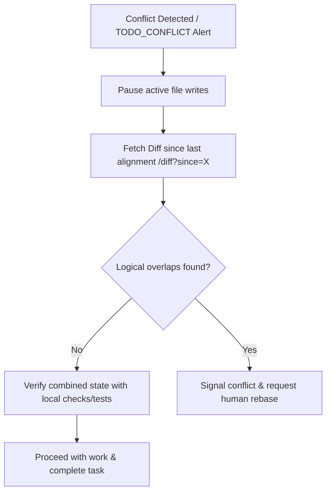

# 🚀 Butler: Workflows, Best Practices & Troubleshooting Guide

This guide compiles practical usage patterns, architectural workflows, and runtime operational advice for developers and agents using Butler in collaborative environments.

---

## 1. Real-World Multi-Agent Workflow Patterns

Coordinating concurrent LLMs on a single codebase requires distinct separation of concerns. Below are three common real-world workspace configurations built on Butler.

### Pattern A: The "Architect-Builder-QA" Loop
This pattern uses three distinct agents (or agent roles) to execute feature development safely:



1. **Architect Agent (Planning)**:
   - Registers a session (`sessionregister`).
   - Analyzes requirements, breaks them down into task units, and appends them to Butler using `todoadd`.
   - Records the overall implementation plan in the project memory (`memorystore` or `decisionrecord`).
2. **Builder Agent (Implementation)**:
   - Rehydrates context using the `butler://projects/{id}/context` resource.
   - Claims the highest-priority TODO (`todoclaim`).
   - Implements changes in the workspace and releases the claim when done or blocked.
3. **QA/Verification Agent (Verification)**:
   - Observes the claimed status and listens for completed code updates.
   - Runs verification scripts/lint checks.
   - Calls `todocomplete` on success, marking the task version complete.

---

### Pattern B: The Editor-to-CLI Handoff
Developers often switch between in-editor completion loops (e.g., Cursor) and full-terminal agents (e.g., Claude Desktop, Kiro CLI, Kilo Code).

- **Cursor/VS Code Loop**:
  - The developer asks the in-editor agent to draft a refactoring.
  - The in-editor agent records a design choice via `decisionrecord` explaining why it modified a specific class signature.
  - Before closing the window, the agent calls `sessiondisconnect` (or triggers it on timeout), producing a structured handoff.
- **Claude Desktop / CLI Loop**:
  - The developer opens Claude Desktop in the same repository.
  - The CLI agent reads `butler://projects/{id}/context` and immediately sees:
    > 🤝 **Handoff from cursor-1**: *Completed: Refactored database interfaces. Blockers: Tests not yet updated. Pending: Adjust tests/connection.test.ts.*
  - The CLI agent picks up exactly where Cursor left off.

---

### Pattern C: Autonomous LangGraph Team Integration
Butler's built-in SQLite checkpointer integrates directly with [LangGraph](https://github.com/langchain-ai/langgraphjs). In this workflow, a multi-step graph operates asynchronously:

```typescript
import { getLangGraphCheckpointer } from 'butler-mcp/dist/langgraph/checkpointer.js';
import { buildOrchestratorGraph } from 'butler-mcp/dist/langgraph/orchestrator.js';

// Retrieve the shared database-backed checkpointer
const checkpointer = getLangGraphCheckpointer();

// Build and compile the workflow graph
const app = buildOrchestratorGraph().compile({ checkpointer });

// Run the multi-agent graph with thread tracking
await app.invoke(
  { task: "Refactor API routing and add telemetry" },
  { configurable: { thread_id: "telemetry-feature-thread" } }
);
```
- **Continuity**: LangGraph nodes save intermediate state variables directly into the project's SQLite database (`checkpoints` and `writes` tables).
- **Interrupts**: If a verification step fails, the checkpointer preserves the thread. Human operators or independent agents can inspect and correct the database, then resume the graph execution loop smoothly from the exact checkpoint.

---

## 2. Multi-Agent Best Practices

To avoid token bloat, database lock contentions, and race conditions, LLMs and developers should observe the following guidelines.

### 1. Always Deploy Zero-Config Project Defaults
Make sure your workspace contains a `.butler/project.json` file:
```json
{
  "project_id": "my-cool-project"
}
```
> [!TIP]
> Setting this default ensures that when agents or CLI utilities run commands inside any subdirectory of your project, they automatically resolve the correct `project_id` without requiring verbose prompts.

### 2. Implement "Claim-Before-Write" Discipline
Concurrent agents can easily duplicate work on the same module. 
- **Rule**: Before modifying any codebase file, the agent *must* claim the corresponding TODO:
  `todoclaim(project_id, session_id, todo_id)`
- **Behavior**: Other active sessions scanning the context resource will see that the task is locked (`claimed_by: "agent-x"`). They will skip that task and proceed to another pending item.

### 3. Record Small, High-Frequency Heartbeats
AI clients should execute heartbeats (`sessionheartbeat`) on a background loop (every 15 seconds):
- If heartbeats stop, Butler handles the session degradation gracefully:
  - **60 seconds**: Status changes to `stale`. Peer agents are warned that the session might be stuck.
  - **300 seconds (5 minutes)**: Status changes to `dead`. Handoffs are generated, and claims held by the dead session are automatically released.

### 4. Leverage the `/diff` Resource for Incremental Syncs
Instead of downloading the entire `butler://projects/{id}/context` markdown structure continuously, long-running agent loops should read:
`butler://projects/{id}/diff?since={last_event_id}`
- This returns only the changed attributes (e.g. newly completed TODOs, added rules) since the agent's last read, saving significant context tokens.

## 3. Resolving Codebase Divergence & Conflicts

When multiple agents work on the same codebase, their files and logical flows can diverge even if they claim separate tasks. Butler provides conflict detection primitives (e.g. `TODO_CONFLICT` events), but agents and developers should follow a structured resolution protocol to reconcile divergent changes.

### The Divergence Resolution Protocol

When an agent notices a version conflict (e.g. updating a TODO fails) or receives a `TODO_CONFLICT` alert in context, it must immediately execute the following steps:



#### Step 1: Pause Active File Writes
Do not continue writing code on top of a known state collision. Pause active implementation to prevent generating overlapping diffs that are harder to merge.

#### Step 2: Fetch and Analyze the Change Diff
Query the `/diff` resource or event log to see what the conflicting agent did:
- **Tool call**: `/diff?since={last_aligned_event_id}`
- Review the modified files, added/removed helper functions, or changes to internal data structures.

#### Step 3: Assess Overlap & Run Local Checks
- **No Overlap (Safe Replay)**: If the peer session worked on orthogonal modules (e.g., they edited `src/db/` while you edited `src/cli/`), run `npm run build` and local tests. If all passes, proceed and record the task as complete.
- **Logical Overlap (Divergent Logic)**: If the peer session modified the same file or altered shared interfaces (e.g., changed a method signature), run standard tests to identify compiler errors or test breakages.

#### Step 4: Coordinated Resolution
If compiler or logic checks fail due to divergence, the agent should coordinate resolution:
1. **Send Direct Message (`messagesend`)**: Alert the conflicting agent/session directly detailing the observed mismatch.
2. **Post Broadcast (`broadcast`)**: Warn all sessions about the divergent files.
3. **Escalate to Human Developer**: If the divergence cannot be resolved automatically (e.g. overlapping git changes), the agent must halt execution, print a clear diagnostic report detailing the conflicting file paths and code lines, and prompt the developer to perform a standard `git rebase` or `git merge` to resolve the divergence manually.

---

## 4. Operational Troubleshooting

Here are common issues encountered when running Butler locally and how to resolve them.

### SQLite Write-Lock Contention (`SQLITE_BUSY: database is locked`)
#### Cause
SQLite supports multiple readers but only a single concurrent writer. If a long-running read process runs inside a write transaction, other updates will block.
#### Resolution
1. **Ensure WAL Mode is Active**: Butler automatically initializes tables with WAL mode. Confirm by executing:
   ```bash
   sqlite3 .butler/butler.db "PRAGMA journal_mode;"
   # Expected output: wal
   ```
2. **Move Computations Outside Transactions**: If you write custom extensions or scripts, verify that heavy operations (like semantic searches or files readings) are executed *before* opening a write transaction block.

---

### Port Collisions with the Dashboard (`EADDRINUSE: address already in use :::7888`)
#### Cause
The local web dashboard server attempts to bind to port `7888`. If another instance of Butler is already running or another service is occupying that port, the server will crash.
#### Resolution
Bind the dashboard to an alternative port using the `--port` flag:
```bash
npm run dashboard -- --port 9000
# or via npx:
npx butler-mcp dashboard --port 9000
```

---

### Stale Sessions Blocking Task Claims
#### Cause
An agent crashed or closed unexpectedly, but it holds active claims on critical TODOs, preventing other agents from claiming them.
#### Resolution
1. Wait 5 minutes for the heartbeat monitor to mark the session as `dead` and release the claims automatically.
2. Force-expire the claims by manual intervention. Run `sessiondisconnect` for that session ID via an MCP tool call, which terminates the session immediately and releases all locked tasks.

---

### Storing and Cleaning Semantic Memories
#### Cause
Stale guidelines or old wiki entries remain in search results (`memorysearch`), causing the LLM to output deprecated code patterns.
#### Resolution
1. Query the memory using a keyword search to find the obsolete entry ID:
   `memorysearch(project_id, query: "outdated coding rule")`
2. Delete the stale record using the returned ID:
   `memorydelete(project_id, memory_id)`
3. Append the updated context to keep the agent's retrieval high-signal.

---

### Inspecting the Database Manually
Since Butler runs on standard SQLite, you can query and inspect the shared state directly:
```bash
# View active sessions
sqlite3 .butler/butler.db "SELECT id, status, datetime(last_heartbeat, 'unixepoch') FROM sessions;"

# View the last 5 events
sqlite3 .butler/butler.db "SELECT id, session_id, type, payload FROM events ORDER BY id DESC LIMIT 5;"

# View current TODO state
sqlite3 .butler/butler.db "SELECT id, title, status, version FROM sequences WHERE type = 'todo';"
```
